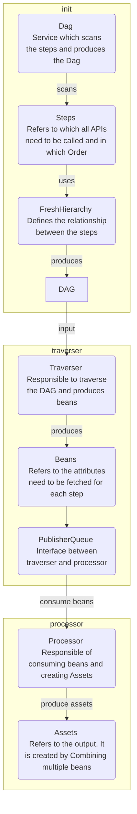
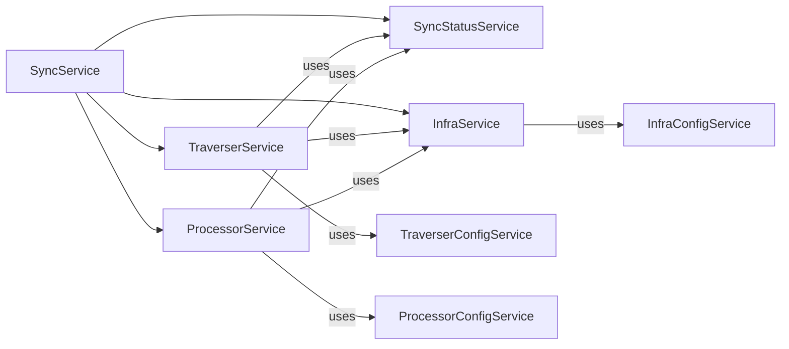
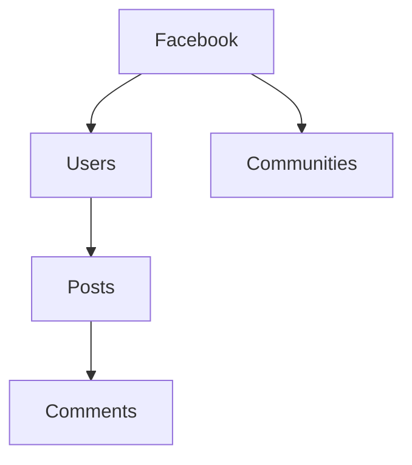

# Hagrid - Connector Development Framework
Hagrid is a generic connector development framework. It can be used to develop any kind of connector which communicates with third party services over HTTP.

## Internals of Hagrid
In this doc, we will present the internal of Hagrid.

### High Level Components & Flow 



### Design & Data Structures 

While designing Hagrid, we include lots of proven designs and create custom data structures like below

#### Designs Inspiration

1. Kafka Streams as `Processor & Publisher Queue` in Hagrid  
2. Kafka Topology as `DagService` in Hagrid
3. Kafka Joins as `@FreshJoin` in Hagrid
4. Kafka Topics as `ProcessorQueue, PublisherQueue, TraverserList` in Hagrid
5. Redis Table as `Key_value` in Hagrid
6. Informatica - as `Traverser & Processor Service` in Hagrid
7. Spring Boot - as `IOC Container` in Hagrid

#### Data structure Used
1. Tree Traversal for Dag Traversal
2. Bloom Filters for efficient lookups   
3. Semaphores for managing concurrency 
4. Queue, List & Key Value implementation on the top of MongoDB
5. Lock free thread Safe classes using `CAS` instructions 

### High Level Service Design 



### Internal of FreshHierarchy

Suppose we have a DAG like 



Now `DagService` will scan the `steps` and will try to create the DAG out of it.
DagService perform scan and uses the `FreshHierarchy` annotations define on the `steps` to create the DAG. Something like below  

```java
@FreshHierarchy(parentClass = ParentStep.class, rateLimit = 800, duration = 1)
class Facebook extends AbstractStep{
    
    // Here override all the methods coming from AbstractStep
}

@FreshHierarchy(parentClass = Facebook.class, rateLimit = 800, duration = 1)
class Users extends AbstractStep{

   // Here override all the methods coming from AbstractStep
}

@FreshHierarchy(parentClass = Users.class, rateLimit = 800, duration = 1)
class Posts extends AbstractStep{

   // Here override all the methods coming from AbstractStep
}

@FreshHierarchy(parentClass = Posts.class, rateLimit = 800, duration = 1)
class Comments extends AbstractStep{

   // Here override all the methods coming from AbstractStep
}

@FreshHierarchy(parentClass = Facebook.class, rateLimit = 800, duration = 1)
class Communities extends AbstractStep{

   // Here override all the methods coming from AbstractStep
}
```

Once `DagService` scans the steps then it produces like below.


### Internal of FreshJoins 

Fresh joins are inspired from the [`Kafka Joins`](https://developer.confluent.io/courses/kafka-streams/joins/#:~:text=Stream%2Dstream%20joins%20combine%20two,arrive%20within%20the%20defined%20window)

Suppose we have a DAG like


Now suppose you want to create an asset like below 

```java

@FreshJoin(rightClass = Community.class, uniqueJoinName = "user_community_join", join_type = FreshJoin.JOIN_TYPE.INNER_JOIN,
        onFieldList = {
                @FreshJoin.OnField(rightClassFieldName = "ownerId", leftClass = User.class, leftClassFieldName = "userId"),
        })
class UserCommunities{
    
    String communityOwner; // it would the userName from user bean
    String communityName;  // It would be the community name from community bean
   
   void setCommunityOwner(User user){
       this.communityOwner = user.getUserName();
   }
   
   void setCommunityName(Community community){
       this.communityName = community.getName();
   }
}
```

@Freshjoins joins the two bean stream to create the asset. Like in the above case, we are creating the asset `UserCommunities`, which are the join of two beans `Community` and `User`. 

The beans are joined based on a common key, which are provided in @Freshjoin. Unlike Kafka, there is not a time window of the join. Like Kafka uses data store to look up the events (beans in our case), Hagrid also uses the data structure called `key_value` to store the stream of beans for lookup.  

##### Inner Joins
If and only if both sides are available, a join is emitted. Thus, if the left class bean has already come but the right class has not, then nothing will be emitted. 

##### Outer Joins [ Not yet implemented ]
With an outer join, both (left and right class ) beans always produce an output an asset. If both the left side and the right side are available, a join of the two is returned. 
If only the left side is available, the join will have the value of the left side and a null for the right side. The converse is true: If only the right side is available, the join will include the value of the right side and a null for the left side.

##### Left-Outer Joins
Left-outer joins also always create the assets. If both sides are available, the join consists of both sides. Otherwise, the left side will be returned with a null for the right side.


### Data Modelling
While traversing DAG by traverser and processing assets by processing, Hagrid need to organise and store lots of information in a way which helps 
traverser to traverse the child nodes of the Dag and help processor to create the assets with right information. 

Hagrid follows a recursive data modelling wherein, every `bean` discovered by traverser would know its parent `bean`. 
In other words, every `bean` holds the reference of its `parent` bean and `parent` bean holds the reference to its `parent` until `parent` become null.

Suppose we have a DAG like


At some point, we would have a bean of `posts` like below. 

```json
{"clazz":"com.freshworks.beans.Posts",
  "parentBean":{"clazz":"com.freshworks.beans.User","userId":"345-2345-213","userName":"Preston Morissette", "parent": null},
  "postId":"654-10-5639","post":"Preston Morissette is a resident of bangalore"}
```

In the above Json if you see, bean `com.freshworks.beans.Posts` contains the reference of its parent bean i.e. `com.freshworks.beans.Users`.
This model helps Hagrid, to stitch the related data together which is eventually helpful in creating the assets.  


#### Benefits of the above approach

1. Hagrid supports scheme wherein a child node URL depends on its parent and grandparent. For example - Take the above case of `Facebook` 
It could be possible that the `comments` have the following API signature, `https://facebook.com/v1/users/{userId}/posts/{postId}/comments`.
If the URI scheme is like above then we need to make `postId` and `userId` available to the traverser so that connector developer can create the `comments` URI. 

2. While creating an asset, as soon as a bean is created by `traverser` and pushed into the queue of `processor` then `processor` looks for if it can create the asset immediately.
For this, processor check if assets depends on ONLY this bean OR it depends on any other bean. 
   1. If asset depends on only this bean then it unwrap the bean i.e. unwrap bean into itself, parent, grandparent beans and create the asset.
   2. If the asset depends on some other bean as well, processor checks if the other bean already exists and perform join based on the `Freshjoin`. Once it figured out the beans on which it depends, it unwraps the beans and create the asset.


