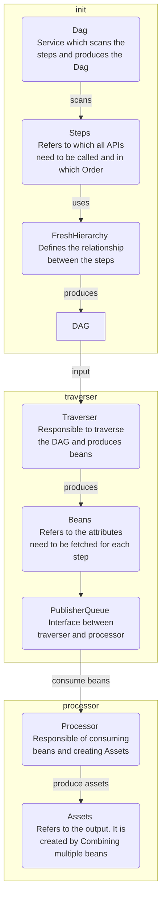

# High Level Diagram

```mermaid
flowchart TD
    
   
    FreshHierarchy(FreshHierarchy <p> Defines the relationship between the steps)
    Steps(Steps <p> Refers to which all APIs need to be called and in which Order)
    Beans(Beans <p> Refers to the attributes need to be fetched for each step ) 
    Assets(Assets <p> Refers to the output. It is created by Combining multiple beans)
    
    DagService(Dag <p> Service which scans the steps and produces the Dag)
    Traverser(Traverser <p> Responsible to traverse the DAG and produces beans)
    Processor(Processor <p> Responsible of consuming beans and creating Assets)
    PublisherQueue(PublisherQueue <p> Interface between traverser and processor)
   
    
    subgraph init
    DagService -- scans --> Steps --uses --> FreshHierarchy --produces --> DAG
    end  
    
    subgraph traverser
    DAG --input--> Traverser --produces--> Beans --> PublisherQueue
    end
    
    subgraph processor
    PublisherQueue --consume beans--> Processor -- produce assets --> Assets
    end
     
    
```