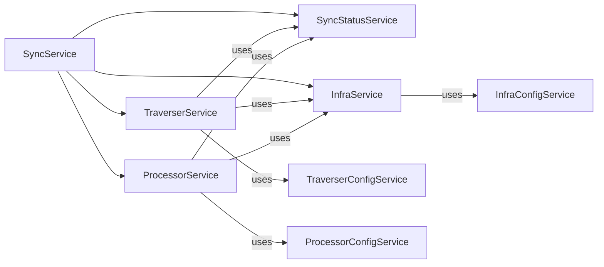

### Low Level Service Design

```mermaid

flowchart LR;
    SyncService --> TraverserService
    SyncService --> ProcessorService
    SyncService --> SyncStatusService
    SyncService --> InfraService
    
    InfraService --uses--> InfraConfigService
    
    TraverserService --uses--> TraverserConfigService
    TraverserService --uses--> InfraService
    TraverserService --uses--> SyncStatusService
    
    ProcessorService --uses--> ProcessorConfigService
    ProcessorService --uses--> SyncStatusService
    ProcessorService --uses--> InfraService
    
```