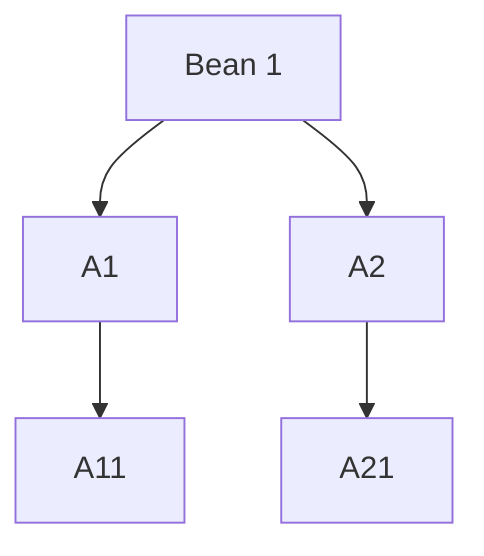
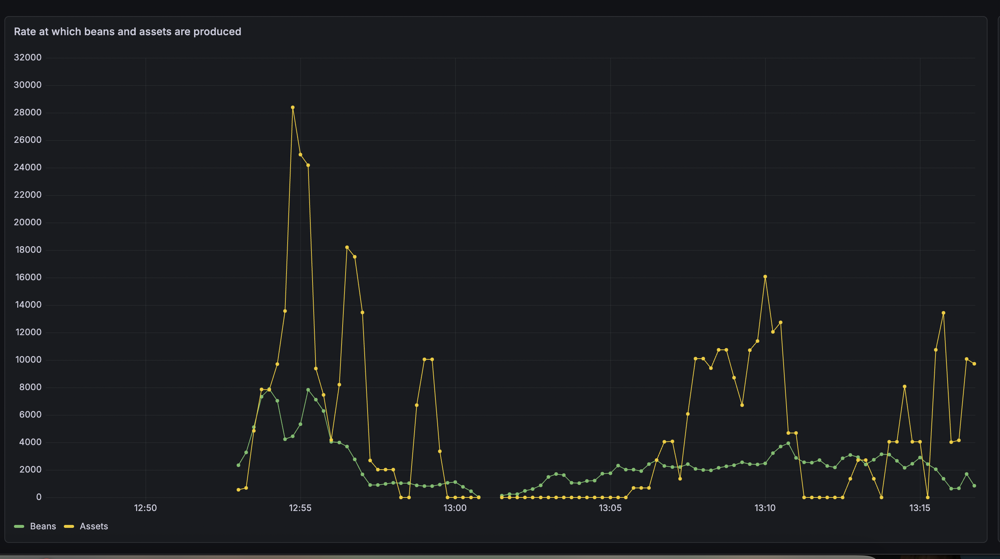
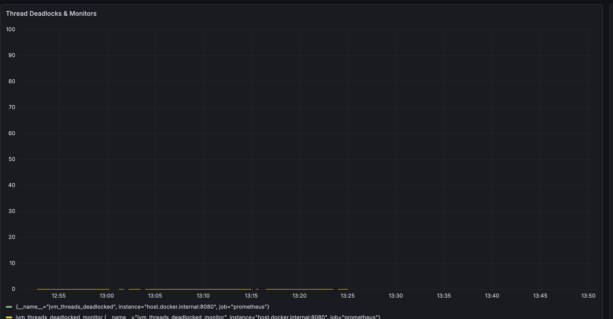
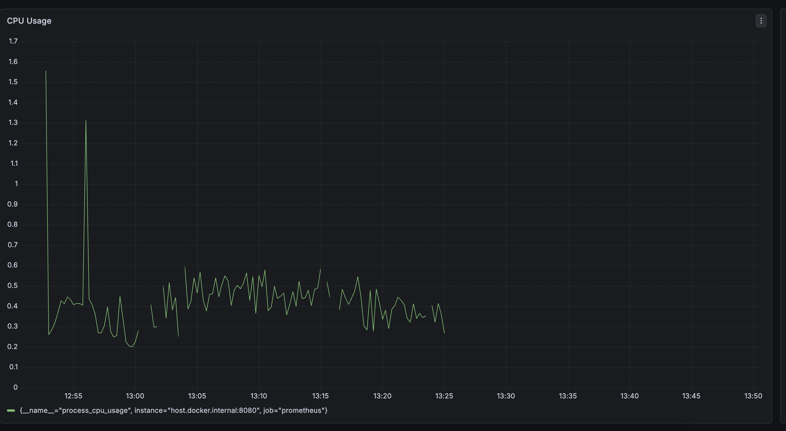

# Title
Enchanment in `freshJoin` works to support for creating assets which could be the combination of two or more other assets. 

## Abstract
Currently, assets are created through beans. If I want to create an asset say `AssetA` from bean `BeanA` then 
I can simply have a method `setFromBean(com.freshworks.Beans.BeanA beanA)` and set the properties. 

Now suppose I would like to create an asset which is combination of two beans for example, I have an asset `AssetCombined` which should be have attributes of two beans `BeanA` and `BeanB` then I can use `FreshJoin` and join these two beans on some common key and have two methods `setFromBean(com.freshworks.Beans.BeanA beanA)` and `setFromBean(com.freshworks.Beans.BeanB beanB)` 

Now suppose I would like to create an asset which is combination of three or more beans for example, I have an asset `AssetMultipleCombined` which should have attributes of three beans `BeanA` , `BeanB` and `BeanC` then in this case I do not have any direct way using `FreshJoin` as `FreshJoin` supports join of two beans. 

`Hagrid` try to provide this feature by using this logic. 
1. First create an intermediate asset by joining two beans `BeanA` and `BeanB` using `FreshJoin`. 
2. Override a method named `publishAsBean` of this asset to `true`. If notify `Hagrid` to NOT to publish this asset into `publisher_list` rather publish this asset as a bean into `processor_queue`. 
3. When `processorService` will consume this so called `bean` then it can be used to create actual asset by joining with `BeanC`   

Problems with Above approach 
1. We can not publish asset as an bean because every bean has its parent associated with it. In this kind of bean, it will lost its parent and may break the integrity of the system and may cause unexpected issues
2. Even if we add the parent to this bean, then which parent should we add as this asset is created using two beans. 

Given above drawbacks, above approach of publishing asset an a bean is not right. 

Proposed Solution 
My proposed solution is following 
1. Use `freshJoin` to join two or more assets instead of beans
2. Let developer create assets of each associated beans. For example if there is bean `BeanA` and `BeanB` then developer should create asset `AssetA` from `BeanA` and `AssetB` from `BeanB` 
3. Developer can create an asset by combining other assets like `AssetA` and `AssetB` to create `AssetC` 
4. Hence `freshJoin` should work on `assets` instead of `beans`

By changing the way `freshJoin` works ( instead of beans, join with assets ), we can write a service, which will consume geneated assets and check if there is any asset which depends on this asset ( in freshjoin ). If so then we can proceed as we do today. 
This approach will be rid of the two drawbacks listed above away which are 
1. Keeping sanity of `beans` intact i.e each bean MUST be traced back to which parent has generated it. 
2. There wont be any issue of multiple parents as `freshJoin` will have assets instead of beans


## Table of Contents
- [Title](#title)
  - [Abstract](#abstract)
  - [Table of Contents](#table-of-contents)
  - [Introduction](#introduction)
  - [Goals and Requirements](#goals-and-requirements)
    - [Product Goals](#product-goals)
    - [Technical Goals](#technical-goals)
  - [Proposed Specification](#proposed-specification)
    - [Product Specification](#product-specification)
    - [Technical Specification](#technical-specification)
  - [Use Cases](#use-cases)
    - [Primitive Asset Usecase](#primitive-asset-usecase)
    - [Non Primitive Asset Usecase](#non-primitive-asset-usecase)
  - [Design Overview](#design-overview)
  - [Detailed Design](#detailed-design)
  - [Compatibility](#compatibility)
  - [Impact](#impact)
    - [Customer Impact](#customer-impact)
    - [Technical Impact](#technical-impact)
    - [Performance Impact](#performance-impact)
      - [Screenshot for Rate of Bean vs Asset](#screenshot-for-rate-of-bean-vs-asset)
      - [Screenshot for JVM Deadlock](#screenshot-for-jvm-deadlock)
      - [Screenshot for CPU Usage](#screenshot-for-cpu-usage)
    - [Documentation Impact](#documentation-impact)
      - [Use Case](#use-case)
      - [General](#general)
  - [Alternatives](#alternatives)
    - [Problems with this idea](#problems-with-this-idea)
  - [Testing](#testing)
  - [Reference Implementation](#reference-implementation)
  - [Contributors](#contributors)
  - [Schedule](#schedule)
  - [Appendices](#appendices)
  
## Introduction
Currently, assets are created through beans. If I want to create an asset say `AssetA` from bean `BeanA` then 
I can simply have a method `setFromBean(com.freshworks.Beans.BeanA beanA)` and set the properties. 

Now suppose I would like to create an asset which is combination of two beans for example, I have an asset `AssetCombined` which should be have attributes of two beans `BeanA` and `BeanB` then I can use `FreshJoin` and join these two beans on some common key and have two methods `setFromBean(com.freshworks.Beans.BeanA beanA)` and `setFromBean(com.freshworks.Beans.BeanB beanB)` 

Now suppose I would like to create an asset which is combination of three or more beans for example, I have an asset `AssetMultipleCombined` which should have attributes of three beans `BeanA` , `BeanB` and `BeanC` then in this case I do not have any direct way using `FreshJoin` as `FreshJoin` supports join of two beans. 

`Hagrid` try to provide this feature by using this logic. 
1. First create an intermediate asset by joining two beans `BeanA` and `BeanB` using `FreshJoin`. 
2. Override a method named `publishAsBean` of this asset to `true`. If notify `Hagrid` to NOT to publish this asset into `publisher_list` rather publish this asset as a bean into `processor_queue`. 
3. When `processorService` will consume this so called `bean` then it can be used to create actual asset by joining with `BeanC`   

Problems with Above approach 
1. We can not publish asset as an bean because every bean has its parent associated with it. In this kind of bean, it will lost its parent and may break the integrity of the system and may cause unexpected issues
2. Even if we add the parent to this bean, then which parent should we add as this asset is created using two beans. 

Given above drawbacks, above approach of publishing asset an a bean is not right. 

Hence we need a solution which can work without compormising the integrity of the system and works within the current system design 

## Goals and Requirements

I have the following goals for this DSR 

### Product Goals 
- Allow developers to create assets which should be created by combining other multiple assets. 

### Technical Goals 
- Changes should be limited to ProcessorService and its sub-components 
- Correctly determining the performance impact of this feature.
- Updating the customer document to enable them on how to use this feature

## Proposed Specification
I propose following specifications to make this feature work 

### Product Specification 

New asset definition will look like below. 

```java
 @FreshJoin('rightClass'= AssetA.class, 'rightClassFieldName' = 'id', 'leftClass' = AssetB.class, 'leftClassFieldName' = 'user_id')
  public class combinedAsset extends AbstractAsset{
     
     String name;
     String company;

     public void setFromAsset(AssetA assetA){
      this.name = assetA.getName();  
     }

     public void setFromAsset(AssetB assetB){
      this.company = assetB.getCompanyName();
     }
  }
```

### Technical Specification 
Make following changes in `ProcessorTaskService` 
   1. Consume `Bean` from `processor-queue` 
   2. Check if any asset can be created from this bean. 
      1. If Yes then create an `asset` and publish it then 
         1. Check if any other `asset` depends on this newly created asset 
         2. If yes then create more assets and publish them
         3. Continue this process until no more assets can be created
      2. If no then continue as it is happening today. 
   

## Use Cases
Following are the possible usecases 

### Primitive Asset Usecase
Primitive asset usecases are the cases where assets are created from beans and there are no asset which is made from join of other two primitive assets

```java
  public class AssetA extends AbstractAsset{
     
     String id;
     String name;
     String company;

     public void setFromBean(BeanA beanA){
      this.name = beanA.getName();  
     }

     public void setFromBean(BeanA beanA){
      this.company = beanA.getCompanyName();
     }

     public void transform(){

       this.id = "_" + this.name + "_;
     }
  }

```

```java
  public class AssetB extends AbstractAsset{
     
     String user_id
     String department;
     String designation;

     public void setFromBean(BeanA beanB){
      this.department = beanB.getDepartment();  
     }

     public void setFromBean(BeanA beanB){
      this.designation = beanB.getDesignation();
     }
  }

```

In above use case, I have created two primitive assets `AssetA` and `AssetB`. 

### Non Primitive Asset Usecase
Non primitive asset usecases are the cases where an asset is created by the combination of two or more other assets

```java
 @FreshJoin('rightClass'= AssetA.class, 'rightClassFieldName' = 'id', 'leftClass' = AssetB.class, 'leftClassFieldName' = 'user_id')
  public class combinedAsset extends AbstractAsset{
     
     String name;
     String company;

     public void setFromAsset(AssetA assetA){
      this.name = assetA.getName();  
     }

     public void setFromAsset(AssetB assetB){
      this.company = assetB.getCompanyName();
     }
  }
```

## Design Overview

I am suggesting that we should modify `ProcessorTask.java` in the following way 
1. [ADD] create a asset queue like `global_asset_creation_queue`
2. [CONTINUE] Process each Bean and convert them into Assets - It is happening today as well. Push these primitive assets into this `global_asset_creation_queue` 
3. [ADD] Once done then Write and call a method lets say `createNonPrimitiveAssets` which will generate new non primitive assets from the assets in this queue 
4. [ADD] Again the newly created non primitive assets should be published back into `global_asset_creation_queue` so that is any more assets can be created
5. This process will continue until the queue `global_asset_creation_queue` become empty


## Detailed Design
In this section, I am going to describe on how we can create non primitive assets from other assets. 

Basic algorithm that I have followed is like this 

1. In `ProcessorTaskService`
2. When `bean` is received then create all `primitive assets` from it. 
3. Collect all these `primitive` assets in `LinkedList` say `abstractAssetList`
4. Loop through each `asset` in this list and create `non primitive assets`
5. Each newly created `non primitive asset` should be added back to `LinkedList` `abstractAssetList`
6. Keep doing this until `abstractAssetList.isEmpty()` is `true`


``` java 
            abstractAssetList.clear();
            for (String bean : itemList) {

                if (Boolean.FALSE.equals(Thread.interrupted())) {

                  // Processing primitive Assets first.
                    abstractAssetList = processBeanForAsset(bean);
                   while(true) {
                       
                        if (abstractAssetList.isEmpty()){
                            break;
                        }

                        // Processing non primitive Assets
                        processAssetForAsset(abstractAssetList.pop());
                       
                   }

                } else {
                    // If thread is interrupted or asked to terminate then skip the list and publish
                    // whatever assets are generated
                    break;
                }
            }

```


Hence the creation of the assets from bean say `bean1` will follow this protocol 



In the above diagram, following process is being demonstrated

1. Bean `bean 1` will generate two assets `A1` and `A2`. These assets will be `appended` to the `abstractAssetList`
2. State of `abstractAssetList` is `[A1, A2]`
3. Next, Asset `A1` will be process, which will produce `A11`
4. State of `abstractAssetList` is `[A2, A11]`
5. Next, Asset `A2` will be process, which will produce `A21`
6. State of `abstractAssetList` is `[A11, A21]`

As you can see from above algorithm, assets will be processed in `BFS` order. Hence if an `asset` is formed by joining two assets at the same level then it will be created immediately ( because of `BFS`)


## Compatibility
This feature will not be backward compatible out of the box because  

*Earlier freshJoin used to work with `AbstractBeans` , however now `freshJoin` will work with `AbstractAssets`  *

However, if customer want to migrate to this feature then they can simple convert their assets into this new way. If they do so then their connectors will keep on working

## Impact

### Customer Impact 
As we are relasing Hagrid `5.0.0` then we can include this feature into this version. Any new customer can use this feature easily

### Technical Impact
There would be impact on `Processor` Module of Hagrid. In `Processor Module` , we have to do following things 
1. Introduce a new service `AssetAssetDependencyService` which will contains mapping for dependency of assets to assets. Basically this dependency is like `AssetBeanDependencyService` . 
2. Changes in `ProcessorTask.java` service to create `non primitive assets` for a given `primitive asset`.  
3. Changes in `AbstractJoinService` , `LeftJoinService` and `InnerJoinService` to create `non primitive assets` from a given `asset`. 

### Performance Impact 
I have done the performance testing with this feature and results seems good with no performance impact on the Hagrid. 

Here are the screenshots of the same. 

#### Screenshot for Rate of Bean vs Asset 




#### Screenshot for JVM Deadlock 



#### Screenshot for CPU Usage 



### Documentation Impact 
We need to change at the following areas in documentation 

#### Use Case 
1. Introduce `primitive` and `non primitive` assets 
2. Show case use case of them 


#### General 
1. Where ever we have referred `@freshJoin` there documentation needs to be updated to reflect this new process


## Alternatives
Alternative that I thought of was like below ( which is described in introduction as well )

Main idea was how do we enable customer to join two or more asset and let them create complex asset types 
We can achieve the same with this alternative however it has many caveats
1. Let `freshJoin` be joined on `beans` instead of `assets` 
2. To create an assets which is the combination from two beans say `bean1` and `bean2`, we can use `freshJoin`
3. Now to create an asset which should be create from this asset ( created in step 2) and another bean like `bean3` , we were thinking of providing a method named `publishAssetAsBean` which will be an asset as bean. Essentially it will serialize this asset into another bean say `bean4` (which should be already defined by the developer) and publish in `processor` queue. 
4. Developer now can create an asset by joining `bean3` and `bean4` 

### Problems with this idea 
There are multiple drawbacks of this alternative 
1. Developer has to create a bean (like `bean3` in above process) in which this asset can be rendered into
2. As per the idea of beans, every bean must have parent from which it is created. If we convert an asset into bean then we are losing that tracking. Which essentially breaks the principle idea of a bean. 

Hence considering above drawbacks, we decided not to go with this approach. 


## Testing
Plans for testing the specification. 
1. I have added test cases in `processor join` package.
2. I have tested it for the performance impact as well. 

## Reference Implementation
I am doing the POC in this branch `https://github.com/freshworks-oss/hagrid-oss/tree/dsr18/feature`

## Contributors
List of individuals and organizations involved in the proposals.

1. Amit Aggarwal - amit.aggarwal@freshworks.com

## Schedule
Timeline for the development and release of the specification.

## Appendices
Additional information, such as glossary, references, or related documents.
