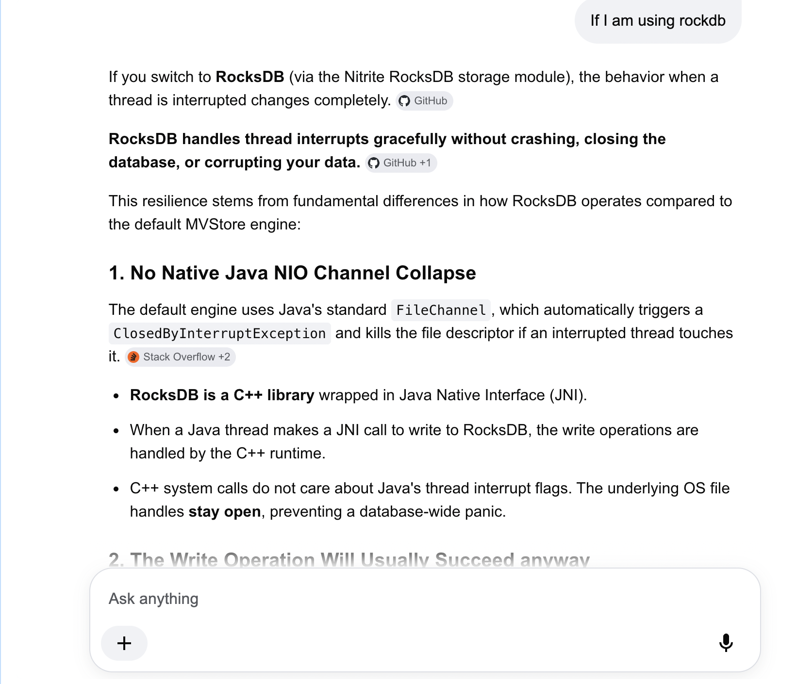
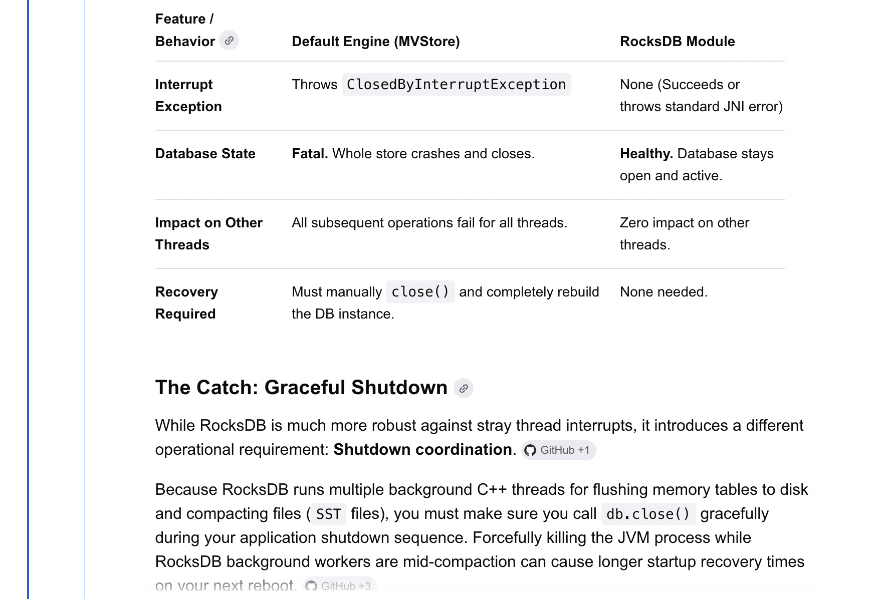

# Title
Adding infra layer of file based database so that we remove databases like mongodb. 

## Abstract

Currently, Hagrid's infra layer has two types 
1. persistent
2. inmemory 

For discovery based connectors, developers need to use `persistent` infra layer i.e Mongodb. So for any developer who want to use Hagrid to develop discovery based connectors need to have `mongodb` set up along with it. 

`Mongodb` set up should be highly scalable due to high writes and reads otherwise infra issues could come up. 
We have faced the similar problems with Freshworks platform team where they need to add secondary replica for read preferences. 
Adding a secondary replica in Mongodb add a problem where at some point in time 
1. Hagrid status goes `successful`
2. data has not been replicated from `primary` to `secondary` mongo instances 
3. `Main` thread when consumes assets then it says all consumed ( from secondary replica) , even though not complete data is replicated in `publisher_list` from `primary` to `secondary` mongo instance 

So if we notice, along with Hagrid development, developers need maintaince of Mongodb as well. 

We can avoid this work by replacing Mongodb with some other file based database which can store upto '100GB' of data
In this process, I have figure out a database named nitrite db which can suit our usecase. 
In this DSR, we can going to detail out how to integrate nitrite database into Hagrid infra layer. 


## Table of Contents
- [Title](#title)
  - [Abstract](#abstract)
  - [Table of Contents](#table-of-contents)
  - [Introduction](#introduction)
  - [Goals and Requirements](#goals-and-requirements)
  - [Proposed Specification](#proposed-specification)
    - [Technical Specification](#technical-specification)
  - [Use Cases](#use-cases)
    - [Usecase of discovery based connector](#usecase-of-discovery-based-connector)
    - [Usecase of orchestration based connector](#usecase-of-orchestration-based-connector)
  - [Design Overview](#design-overview)
    - [Current Status](#current-status)
    - [Required Status](#required-status)
  - [Detailed Design](#detailed-design)
  - [Compatibility](#compatibility)
  - [Impact](#impact)
  - [Alternatives](#alternatives)
  - [Testing](#testing)
  - [Reference Implementation](#reference-implementation)
  - [Contributors](#contributors)
  - [Schedule](#schedule)
  - [Appendices](#appendices)

## Introduction
Currently, Hagrid's infra layer has two types 
1. persistent
2. inmemory 

For discovery based connectors, developers need to use `persistent` infra layer i.e Mongodb. So for any developer who want to use Hagrid to develop discovery based connectors need to have `mongodb` set up along with it. 

`Mongodb` set up should be highly scalable due to high writes and reads otherwise infra issues could come up. 
We have faced the similar problems with Freshworks platform team where they need to add secondary replica for read preferences. 
Adding a secondary replica in Mongodb add a problem where at some point in time 
1. Hagrid status goes `successful`
2. data has not been replicated from `primary` to `secondary` mongo instances 
3. `Main` thread when consumes assets then it says all consumed ( from secondary replica) , even though not complete data is replicated in `publisher_list` from `primary` to `secondary` mongo instance 

Due to this, developers are missing some assets which are not yet published in `secondary` due to `database` lag. 
So if we notice, along with Hagrid development, developers need maintaince of Mongodb as well. 

In this DSR, I would like to add another infra type `nitrite` which is a `file based no sql` database. This database can potentially be the replacement of `mongodb` for discovery based connectors

We had earlier attempted to have `file based` database system using `H2 database` however it does not work due to following issues 

1.  Hagrid demands creation and deletion of tables at run time. However due to `H2` `ACID` nature, creating and deleting tables causing delays and eventually thread exceptions 

2. Whenever thread is interrupted ( due to reason like hagrid shutdown ) and it is making a connection to database file via `FileChannel NIO API` then if this thread has `interrupt` enabled , it throws `MVStoreException` 
  
With this version of file based database `nitriteDB` we will make sure that we resolved these threading issues and provide clear implementation. 


## Goals and Requirements
- Onboard file based no sql database like `nitriteDB` 
- Performance of the Hagrid should be increase or atleast no impact
- Validating if `nitrireDB` can be used in `orchestration` based connectors as well. 
- `NitriteDB` works well in conditions when threads are interrupted    

## Proposed Specification
Below are the technical specifications 

### Technical Specification

1. Implement `nitriteDBService` 
2. Implement `nitriteDBList`
3. Implement `nitriteDbQueue`
4. Implement `nitriteDBKeyValue`
5. Make changes in `InfraBeanConfiguration` service to create instance of `nitriteDB` 
6. Introduce a new `infra type` in `hagrid.yml` named `nitriteDB` which will indicate that customer want to use `nitriteDB`


## Use Cases

### Usecase of discovery based connector

If customer is developing a `discovery` based connector and want to use `nitriteDb` then he can mention as such in `hagrid.yml` 


``` yaml

  infra:
      infra_type: "nitrite"
      nitrite_data_path: "/Users/aaggarwal/Documents/hagrid-releases/hagrid-oss/hagrid-oss/database"
      nitrite_database_type: "file"

```
Above keys are translated in the following way

1. Above `infra_type` means that customer want to use `nitrite` db. 
2. `nitrite_data_path` is the path of the directory where `nitriteDB` should create its database files
3. `nitrite_database_type` `file` meaning that customer want to use `file based` database. 


### Usecase of orchestration based connector

If a customer is develiping a `orchestration` based connector and want to use `nitriteDB` then he can mention as such in `hagrid.yml`

``` yaml

  infra:
      infra_type: "nitrite"

```

If key `nitrite_database_type` is not present then `Hagrid` by default assume that customer want to create inmemory database


## Design Overview

Below is the high level design overview that we are going to follow 
1. Implement `NitriteService` in the similar fashion as we have implemented `mongoDB` or `H2` 
2. Implement `NitriteDbList` in the similar fashion as we have implemented in `mongoDBList` or `H2List`
3. Implement `NitriteDbQueue` in the similar fashion as we have implemented in `mongoDbQueue` or `H2Queue`
4. Implement `NitriteKeyValue` in the similar fashion as we have implemented in `mongodbKeyValue` or `H2KeyValue`


When we are implementing we are assuming one change that `Hagrid` should make across infra. That change is developer will always save `json` string into the `Infra` . To save `array of json strings` infra already provide `List<String>` methods. 

### Current Status
Currently, all methods of infra accept `String` as parameter to save into the database. Internally in `put` methods ( methods which save the data ) save the string as it is. 

We are looking to change this behaviour to make it manadatory that the string that is being saved must be `json` string

### Required Status
With the implementation of `nitriteDB`, I will assume that all strings that are being saved into `Hagrid` are of the `json` type 

This change give us the ability to use the database functionality itself to search / filter / group by assets. This way, we can remove the need to `freshIndex` that we have created separately. 


## Detailed Design
In-depth technical details, including algorithms, data structures, and workflows.

Discuss about the usecase how thread interrupt causing `MVStoreException` in case of H2 database, however when we will use `nitriteDb` along with `RocksDb` how this interrupt flag does not cause any exception and application code has to handle it explicitly which is the use case for us 





## Compatibility
Discussion of backward compatibility with existing Hagrid versions or APIs. Migration strategies for existing users.

## Impact
Potential impact on the hagrid platform, developers, and users. Considerations for performance, security, etc.

## Alternatives
Other approaches considered and reasons for rejecting them.

## Testing
Plans for testing the specification. 

1. Test if it can store large volume of data
2. Check if value column has hold documents upto 1 MB
3. Check if db works well in case of orchestration use case
4. Check if sync shutdown abruptly then db behaves properly.

## Reference Implementation
Details about the reference implementation of the specification.

## Contributors
List of individuals and organizations involved in the proposals.

## Schedule
Timeline for the development and release of the specification.

## Appendices
Additional information, such as glossary, references, or related documents.
