# Welcome

## Reach out to the community via Google Groups. 
If you have any question, need clarification or any feature idea, please mail at **user-hagrid@googlegroups.com** with your topic and get answers, ideas and suggestions from community members

## Introduction

Hagrid is a connector development framework written in `JAVA` and is available as `SDK` which can be installed via 
`maven` or `gradle`. 

Think of Hagrid framework, like spring boot for java based web applications, Django for python web applications then Hagrid for java based connector applications. 

Like spring boot provides lots of classes and annotations to make web development seamless, similarly Hagrid framework provides many classes and annotations to create a connector application. 

When explaining the working of Hagrid or any other concept of Hagrid through this documentation, we will take the example of `developing a connector to fetch all users, posts, comments, community from Facebook`. 

We are taking `facebook connector` as example because almost everyone is familiar with facebook like `users`, `posts`, `comments`, `communities`.

Hagrid supports developing two kind of connectors, Lets call it 

1. *HTTP Based Connectors* - Connector which fetches data from third party via HTTP calls
      1. If you have http APIs avaialble to fetch data then your connector is going to be `HTTP Based Connector` 
2. *Non HTTP Based Connectors* - Connectors which fetches data via different protocol like mysql
      1. If you do have `commands` available to fetch data then your connector is going to be `Non Http Based Connector` 

### Support for Use cases
Hagrid is a generic connector development frameworks. It means that you can develop any kind of connector on Hagrid.

For instance, you can use `Hagrid` to develop

1. Connector to fetch `products from AWS ecommerce website`
2. Connector to fetch `Users, usages , ACL` from SSO services like `Okta`
3. Connector to fetch `Files and ACLS` from file services like `sharepoint`
4. Connector to fetch `schema and data` from db services like `mysql`
5. Connector to crawl internet - yes this is also possible. 
   

For this documentation, lets deep dive into our dummy `facebook connector` , which is going to a `HTTP Based connector` ( because I have set up some dummy APIs on EC2 for this example)

### Think DAG

Think how APIs are organised of the third-party from where you would like to fetch data.
Developers can identify this information easily from the documentation of the website of the third party. 

For `facebook` example, we can assume DAG will look like this. 

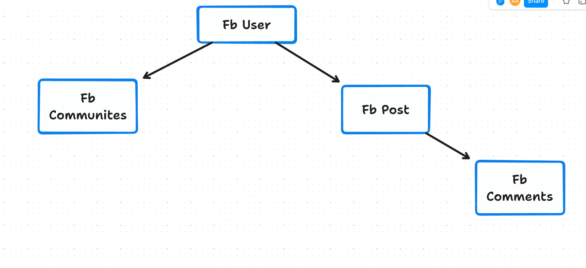

As per above `DAG`, we want to develop a connector which should follow this traversing mechanism 

1. Connector should first fetches `users` of facebook.
2. Connector should fetch `posts`  and `communities` created by each `user` fetched in step 1.   
3. Connector should fetch `comments` made on the  `post` fetched in the step 2.

Another example, say you want to developer a connector to fetch data from `mysql` then in this case `DAG` may look like this 

**Mysql Connector**

Dag to fetch the `tables and Records` from `mysql` may look like this

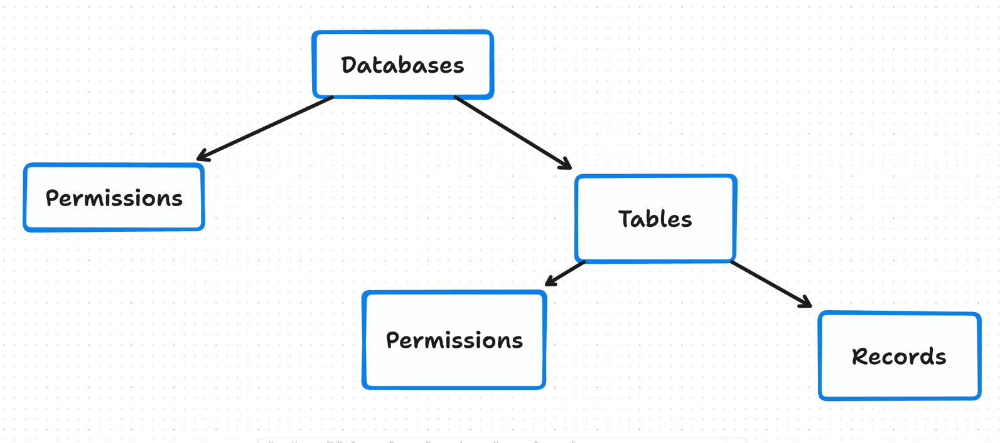

As per above `DAG`, we want to develop a connector which should follow this traversing mechanism

1. Connector should first fetches `databases` from `mysql`
2. Connector should fetch `permissions`  and `Tables` for each `database` fetched in step 1 
3. Connector should fetch `Permission` and `Record`  for each `Table` fetched in step 2

**Note:** : Above DAGs are just for example. Your DAG and process may look little different than presented in this example
For now, lets continue with developing our `facebook connector`

## How does it work

Before I take you through the development of our `facebook` connector, I would like to introduce you to the main concepts of Hagrid. 

Once you understand these concepts then you can develop any connector easily. 
I have divided the concepts of Hagrid in two categories 

1. Connector Configuration 
2. Connector Execution

**Connector Configuration** involves the concepts which are needed to configure the connector, basically letting `Hagrid framework` know that you should behave like this, fetch only so much data from third-party and combine the fetched data in this way so that I can get the desired output. 

**Connector Execution** involves the concepts which describe how I as a developer want to execute the Hagrid and consume the data to send it to my `application layer` to store in some business DB. 

### Connector Configuration
Like I said above, configuration of the connector means answering *three main questions*

1. How Hagrid should fetch the data from third party?
2. Out of data fetched, which data should Hagrid keep it with itself and which should be ignored i.e dropped ? 
3. Once only important data is there, how should Hagrid combine / transform this data into meaningful business objects.

 
Hagrid provides three main concepts which allow developers to configure the answers of the above questions. These three concepts are 

1. Steps - Defines how data should be fetched from third party
2. Beans - Defines, which data (fetched via steps) should be kept and which should be ignored
3. Assets - Combine and Transform data into something meaningful to the business. 

Lets go through each concept one by one.  

#### Steps  
Here are some rules that you should follow to let hagrid know the answer of the question *how to fetch data from third party*

   1. Translate each API Call ( or DAG Node ) to one `java` class (like `FbStepUser.java` , `FbStepPost.java` ) in you java project. 
   2. Use annotation `@FreshHierarchy` on the top of each `step` class to setup the order in which they should be called. Click to know more about [@FreshHierarchy](pages/steps/freshhierarchy_annotation.md).
   3. Each step class extends either `HttpAbstractClass` or `NonHttpAbstractClass` . These classes defines different method which you can override to change the behaviour of Hagrid based on requirements. 
   4. Various methods that you can override are listed here [Step & Its Methods](pages/steps/step_methods.md)
   

Watch series of screenshots which helps you visualize how steps are organised 

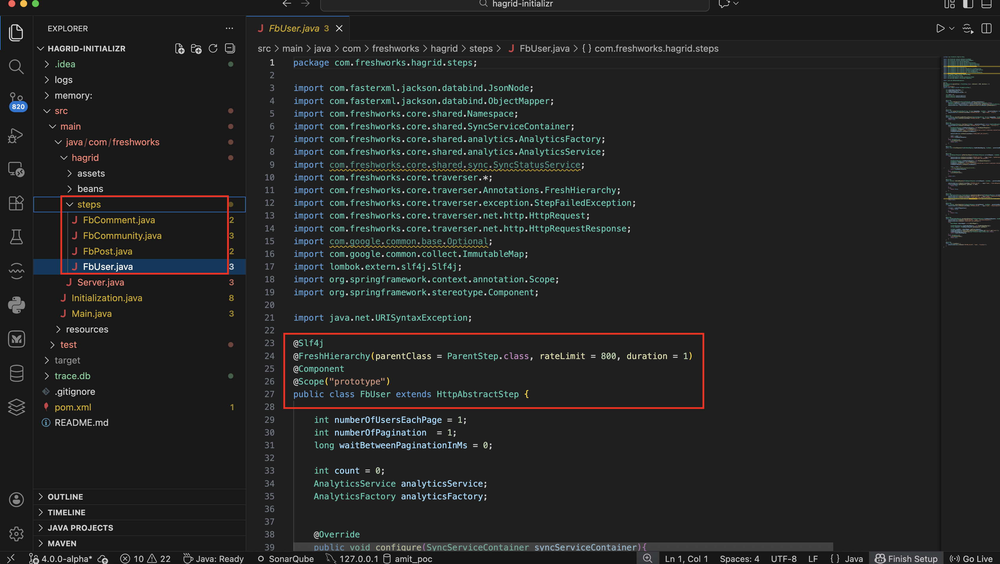

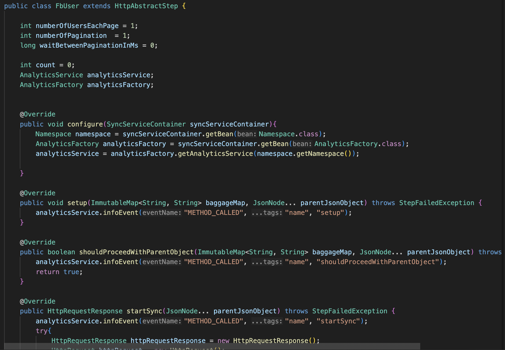
        
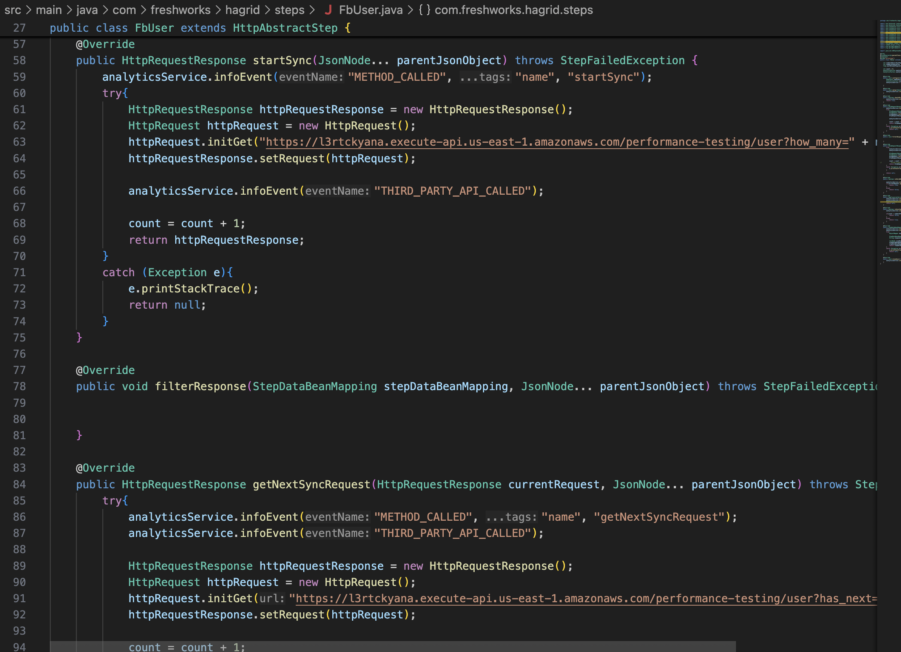

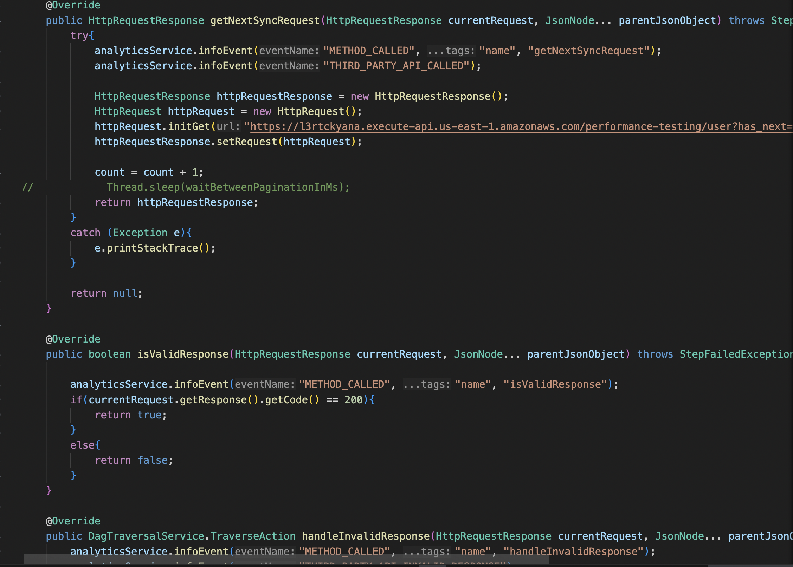

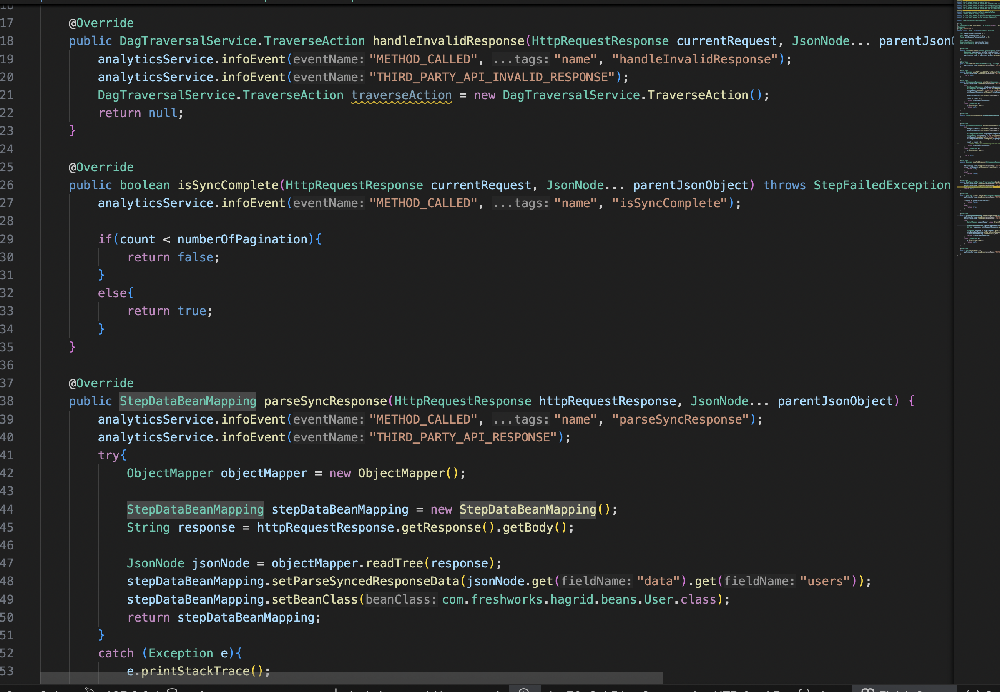

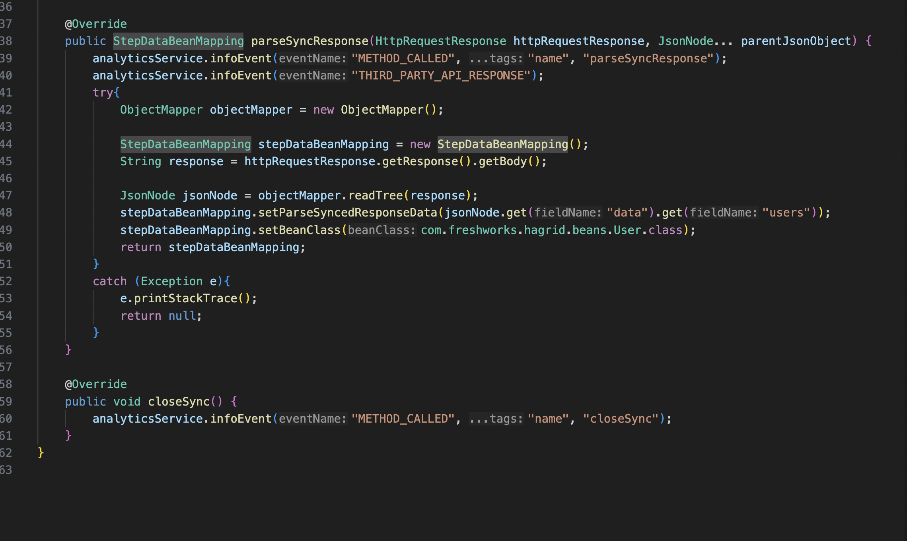

#### Beans 
   1. Think of it like data layer where Hagrid stores all fetched API data. 
   2. Each `step` has its corresponding `bean` class. 
   3. Bean class consists of attributes that you would like to keep. 
      1. Suppose step `FbStepUser.java` has corresponding bean class `FbBeanUser.java`
      2. `FbBeanUser.java` has following attributes `String user_name` and `String email_id` 
      3. When step `FbStepUser` fetches data of the form say `[{user1},{user2},{user3}]`
      4. Hagrid will deserialize this array of JSON into 3 beans of `FbBeanUser` . 
      5. If there is any attribute in `{user1}` which is not defined in `FbBeanUser` then that will be ignored.
   4. So when connectors runs, it generates thousands and millions of beans ( depends on data fetched by steps)
   5. Beans are intermediate object, not consumeable by developers to send to their business applications.

For better understanding please take a look at this [visual diagram](pages/beans/beans.md)  

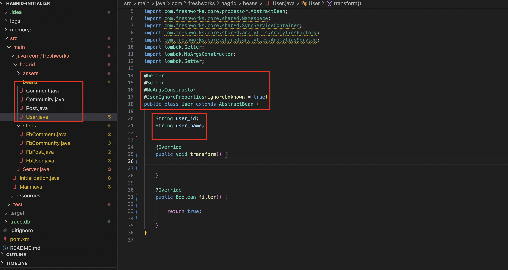

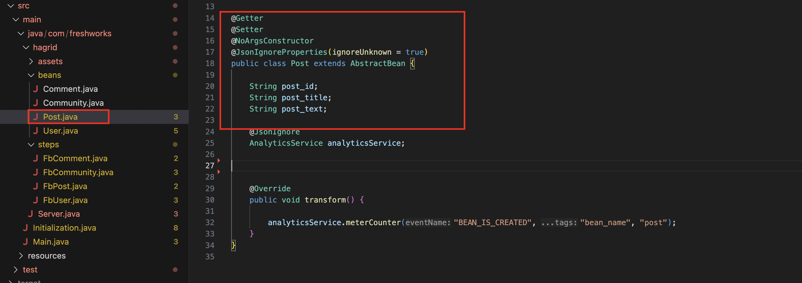

#### Assets 
Think of asset classes like Bean classes except these major differences 

1. Asset object is again a `java` class which set of attributes defined in it, just like beans 
2. Asset object could be of simple type or complex type. 
3. Simple assets is just a translation of Bean attributes to asset attributes. 
4. Complex asset is formed by combining the multiple beans into single asset object. 
5. Assets are consumable by developer to send it to their business application 

For better understanding please take a look at this [visual diagram](pages/assets/assets.md)

Watch below series of screenshots to understand how assets are organised in code

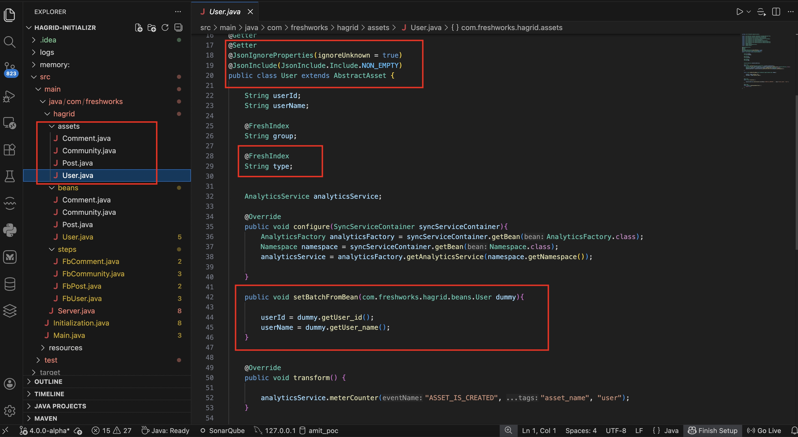

Once you have configured steps, beans and assets then the configuration part of the connector is completed. 
 

### Connector Execution
Once the connector configuration is understood, next question is 
1. How do I run hagrid ?
2. How do I consume assets that are generated by the Hagrid. 

Connector Execution address these two questions. For connector execution phase, Hagrid exposes four important services 
1. `SyncService` 
2. `SyncContainerService`
3. `SyncStatusService` 
4. `ConsumerService`

Lets understand the functionality of these services so that we can get the answers of the above two questions

#### SyncService 

SyncService is the top level service of Hagrid framework which is exposed as `prototype` bean of `spring boot framework`.
Whenever a develop want to run `Hagrid` then they must take `SyncService` object from `spring application context`. 

`SyncService` exposes methods to kick start the Hagrid sync. It exposes methods like `startSync` , `initSyncServiceContainer` etc. 

#### SyncServiceContainer 

Inspired from `spring` `application context` , Hagrid returns `SyncServiceContainer` for each call to `syncService.startSync` or `syncService.initSyncServiceContainer` . 

`SyncServiceContainer` contains instances of the internal services that are instantiated as a part of this sync. 

Developers uses `SyncServiceContainer` to get various services from `SyncServiceContainer` to look into various aspects of the Hagrid. 

For example - Once you get the `SyncServiceContainer` then you can extract `consumerService` which is required to consume the generated assets. 
Once you have `SyncServiceContainer` then you can extract `SyncStatusService` to look into the current running status of the Hagrid 
Once you have `SyncServiceContainer` then you can extract the `InfraService` to look into the data fetched so far by Hagrid. 

#### SyncStatusService 

`SyncStatusService` exposes various methods to know the status of `Hagrid` . These methods are 

1. `getSyncStatus` - It gives you following status 
      1. 1 - If sync is successful 
      2. 0 - If sync is running 
      3. -1 - If sync has failed 
2. `waitUntilSyncIsInProgress` - After running Hagrid, block the thread until Hagrid is in progress 

#### ConsumerService

`ConsumerService` exposes various methods to consume assets generated by Hagrid. These methods are 

1. `getAssetByAssetType` - Provide you list of all the assets (of a given class) that are fetched till now by Hagrid. This API is called usually once Hagrid is done. 
2. `getAssetByAssetTypeAndFilter` - Provide you list of all the assets ( of a given class) and filtered by given expression that are fetched by the Hagrid till now. This API is called usually once Hagrid is done. 
3. `streamAssetByAssetType` - Provide you list of all the assets that has been fetched so far. This API works on token basis and this API can be called even when Hagrid is still in progress

For indepth understanding of how we can consume assets, please take a look at [consumer details](usecases/consumer.md)

Watch series of below screenshots on how connector execution phase works 

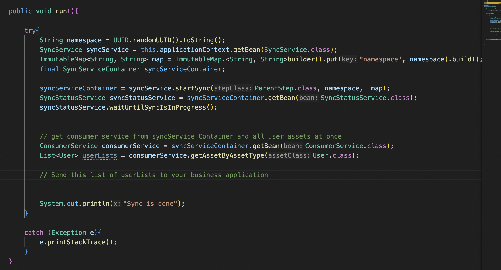

## Summary
With this basic idea of how Hagrid works, here I would like to summarize few things

1. `Hagrid` is generic connector development framework.
2. To develop connector on Hagrid, think in terms of `DAG` i.e. how does API calls are arranged.
3. `Each node` in `Dag` is going to be a `step` in Hagrid. 
4. `FreshHierarchy` annotation helps Hagrid to organised nodes in `DAG`. 
5. Enrich your steps by overriding method from parent class `AbstractStep` so that `Hagrid`
    1. Knows the `URL` from where to fetch the data
    2. Knows how to form next url in case of `pagination`
    3. Knows how to handle if there is `non200 http response`
    4. Filter data and attributes which is of no interest

With the basic understanding of `Dag` and `steps`, next move to [Get Started](pages/concepts.md) to understand some more concepts of Hagrid which is useful and 
mandatory to develop a connector on Hagrid.

Please reach out to me for any suggestions and questions at [Amit Aggarwal](mailto:amit.aggarwal@freshworks.com)

