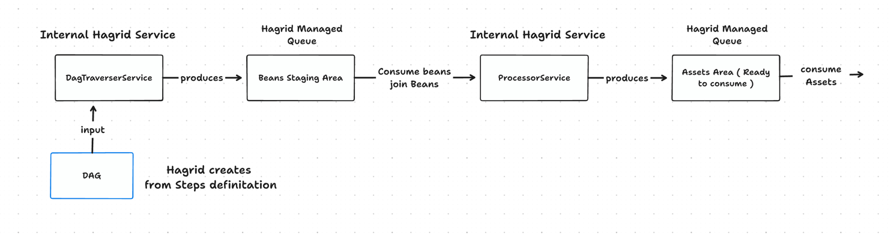

## Introduction 

### Steps
Dag is direct acyclic graph that Hagrid makes internally to execute API requests in particular order. 
Suppose you want to fetch data from AWS cloud for a customer then sequence of API could be

1. Fetch List of AWS regions via Region API
2. For each region fetched, fetch list of VPC in this region via VPC API
3. For each VPC fetch, list of EC2 via EC2 API 
4. For each VPC fetch, list of IPs via IP API

If you see the above sequence, there is some structure that you want to enforce in your connector to say that first fetch all 
regions then only fetch all vpcs then call ec2 for each VPC. 

If you visualize this in some form of data structure then it is DAG ( directed acyclic graph). 
It helps hagrid to understand, how APIs / commands should executed and how they are dependent on each other. 

**Note:** : So when you want to create a connector then think how your DAG might looks like. Some connector DAG has just one API
to be called, so just one node in the DAG. 

### Steps 
Now, once DAG concept is clear, then think of step is like its JAVA implementation. Step is the concrete JAVA class which you implement.
In steps you provide how they are dependent on each other. Based on this information, Hagrid internally creates a DAG. 

So If I take the example of above connector, then you would have the STEP for each DAG Node

1. STEP for `region` lets call it `RegionStep.class`
2. STEP for `VPC`, lets call it `VPCStep.class`
3. STEP for `EC2`, lets call it `EC2Step.class`
4. STEP for `IP`, lets call it `IPStep.class`

In these steps classes, you override some methods which provide information like which API to call and how many times it should be called, some error handling etc. 
Hagrid also provides an annotation `FreshHierarchy` which needs to be mention on the top of each step to establish the relationship between these step ( like DAG node parent-child dependency )

```java
@Slf4j
@FreshHierarchy(parentClass = VPC.class, rateLimit = 800, duration = 1, ignore = false)
@Component
@Scope("prototype")

public class EC2 extends AbstractStep {
    
    // some method will be over ridden here 
}
```

### Beans
Beans are the temporary data objects which holds the data Hagrid fetches from Third-party. 
So in the beans, you define third-party payload structure and attributes that needs to be parsed and render into. 

So ideally, for each step ( it fetches data), you have a bean class ( it stores data). 


### Assets 
Assets are the like beans, they are also java class which holds data but they are meaningful to the business.
Developers can create assets by joining two or more beans (on some attribute of beans) to create one asset. 
Assets can be think of complex objects which are created from the combination of one or more beans. 

### Summary 
Steps fetches data, Beans holds the data , Assets combine beans to create complex and useful business objects. 


## Hagrid Configuration File 

`Hagrid.yml` is the configuration file that is required by `Hagrid` to understand the location of the `steps`, `beans` 
and `assets`.





## Summary
Here is the summary of what we have learnt above. 

### High Level Architecture
High Level Architecture of  `Hagrid` is based on `publisher` and `consumer` model like below 



where, `DagTraversalService` produces fetches data from `third-party` and produces `beans` into the queue named `processorQueue`.
`ProcessorService` consumes the beans, join them ( based on asset definition ) and produces `assets` in the queue named `publisher_list`. 

### Steps, Beans & Assets
These are the three pillars of connector development based on `Hagrid`. You must define all three.

1. `Steps` are used for defining the behaviour of the APIs and hierarchy among them using `FreshHierarchy` annotation.
2. `Beans` are used for defining the attributes that need to be retained into the system.
3. `Assets` are used for defining the final out that you would like to get out of `Hagrid`.

### Hagrid Configuration File 
1. MUST create `hagrid.yaml` file in `resource` directory of your maven project. 
2. MUST contain path for step, bean and assets
3. SHOULD contain `infra` type i.e either `persistent` or `inmemory`
4. CAN contain `processor` configuration like `poll_count` and `number_of_parallel_processor`


Next move to [Develop](develop.md) to develop our first connector. 

Please reach out to me for any suggestions and questions at [Amit Aggarwal](mailto:amit.aggarwal@freshworks.com)


