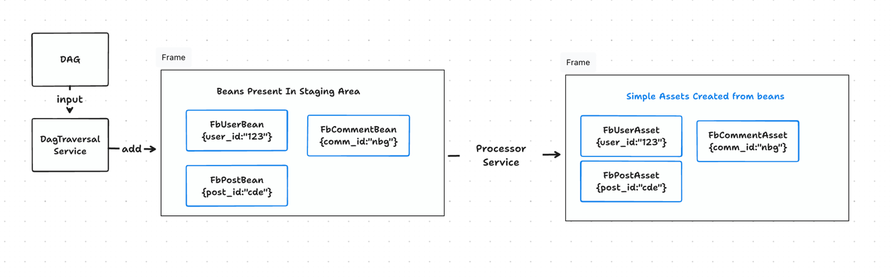

<!-- Assets START -->

<!-- Assets BASIC START -->

`Asset` are the artifacts that you can consume. Assets are created by combining one or more `bean`. 
You can create one `asset` `FbUser` which might be a direct mapping of a `bean` `FbUser`. You can create asset `FbUser` 
joining two or more `beans` on some `key` like joining `FbCommunity` with `FbPost` on `community.creator_id == post.creator_id`

It looks like this 




Once `beans` are defined, dev should define the `assets`. `Assets` can be created from single bean itself or multiple beans can be
joined together in a particular fashion to create a complex `asset`.

Asset definition looks like this

```java
@NoArgsConstructor
@Getter
@Setter
@JsonIgnoreProperties(ignoreUnknown = true)
@JsonInclude(JsonInclude.Include.NON_EMPTY)
public class FbUserAsset extends AbstractAsset {

    public void setFromBean(com.freshworks.hagrid.beans.User userBean) {

        userId = userBean.getUser_id();
        userName = userBean.getUser_name();
    }
}
```

Asset definition for complex asset may look like this 

```java
@FreshJoin(rightClass = FbCommunity.class, uniqueJoinName = "user_community_join", join_type = FreshJoin.JOIN_TYPE.INNER_JOIN,
        onFieldList = {
                @FreshJoin.OnField(rightClassFieldName = "ownerId", leftClass = FbUser.class, leftClassFieldName = "userId"),
        })
class UserCommunities{

    String communityOwner; // it would the userName from user bean
    String communityName;  // It would be the community name from community bean

   void setCommunityOwner(User user){
       this.communityOwner = user.getUserName();
   }

   void setCommunityName(Community community){
       this.communityName = community.getName();
   }
}
```
<!-- Assets BASIC END -->


<!-- Assets FRESH_JOIN START -->

`@Freshjoins` joins the two beans to create the asset. Like in the above case, we are creating the asset `UserCommunities`, which are the join of two beans `Community` and `User`.

```java
@FreshJoin(rightClass = FbCommunity.class, uniqueJoinName = "user_community_join", join_type = FreshJoin.JOIN_TYPE.INNER_JOIN,
        onFieldList = {
                @FreshJoin.OnField(rightClassFieldName = "ownerId", leftClass = FbUser.class, leftClassFieldName = "userId"),
        })
class UserCommunities{

    String communityOwner; // it would the userName from user bean
    String communityName;  // It would be the community name from community bean

   void setCommunityOwner(User user){
       this.communityOwner = user.getUserName();
   }

   void setCommunityName(Community community){
       this.communityName = community.getName();
   }
}
```

The beans are joined based on a common key, which are provided in `@Freshjoin`. Unlike Kafka, there is not a time window of the join. Like Kafka uses data store to look up the events (beans in our case), Hagrid also uses the data structure called `key_value` to store the stream of beans for lookup.

### Inner Joins
If and only if both sides are available, a join is emitted. Thus, if the left class bean has already come but the right class has not, then nothing will be emitted.

### Outer Joins [ Not yet implemented ]
With an outer join, both (left and right class ) beans always produce an output an asset. If both the left side and the right side are available, a join of the two is returned.
If only the left side is available, the join will have the value of the left side and a null for the right side. The converse is true: If only the right side is available, the join will include the value of the right side and a null for the left side.

### Left-Outer Joins
Left-outer joins also always create the assets. If both sides are available, the join consists of both sides. Otherwise, the left side will be returned with a null for the right side.

<!-- Assets FRESH_JOIN END -->

<!-- Assets END -->


