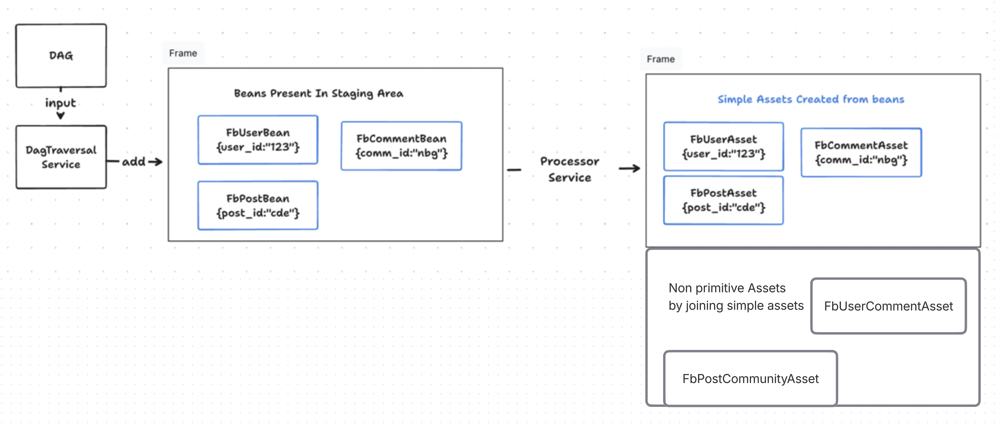

<!-- Assets START -->

<!-- Assets BASIC START -->

`Asset` are the artifacts that you can consume. Assets are of two types `primitive` assets and `non primitive` assets. 

`Primitive Assets` are created from `beans` while `non primitive assets` are created by joining two `primitive assets`


You can create an `asset` `FbUserAsset` which might be a direct mapping of a `bean` `FbUserBean`. 

You can create an asset `FbUserCommentAsset` joining two `primitve assets` on some `key` like joining primitive `FbUserAsset` with primitive `FbCommentAsset` on `user.user_id == comment.creator_id`

It looks like this 



Once `beans` are defined, dev should define their `primitive` `assets`. Once `primitive` assets are defined then developer can create `non primitive` assets by using `freshJoin` as shown below in this doc. 

Primitive Asset definition looks like this

If you notice the `setFromBean` parameter then we have passed a `bean` from which we want `Hagrid` to create this asset. If an asset definition has `bean` parameter then `Hagrid` consider it as `primitive asset` 

```java
@NoArgsConstructor
@Getter
@Setter
@JsonIgnoreProperties(ignoreUnknown = true)
@JsonInclude(JsonInclude.Include.NON_EMPTY)
public class FbUserAsset extends AbstractAsset {

    public void setFromBean(com.freshworks.hagrid.beans.User userBean) {

        userId = userBean.getUser_id();
        userName = userBean.getUser_name();
    }
}
```

Once you have defined the `primtive assets` then you can create `non primtive assets` like below

Non primitive Asset definition for complex asset may look like this 

```java
@FreshJoin(rightClass = FbCommunityAsset.class, rightClassFieldName = "creator_id", leftClass = FbUser.class, leftClassFieldName = "userId", uniqueJoinName = "user_community_join", join_type = FreshJoin.JOIN_TYPE.INNER_JOIN)

class UserCommunities{

    String communityOwner; // it would the userName from user bean
    String communityName;  // It would be the community name from community bean

   void setCommunityOwner(User user){
       this.communityOwner = user.getUserName();
   }

   void setCommunityName(Community community){
       this.communityName = community.getName();
   }
}
```
<!-- Assets BASIC END -->


<!-- Assets FRESH_JOIN START -->

`@Freshjoins` joins the two assets to create another asset. Like in the above case, we are creating the asset `UserCommunities`, which are the join of two beans `Community` and `User`.

```java
@FreshJoin(rightClass = FbCommunityAsset.class, rightClassFieldName = "creator_id", leftClass = FbUser.class, leftClassFieldName = "userId", uniqueJoinName = "user_community_join", join_type = FreshJoin.JOIN_TYPE.INNER_JOIN)

class UserCommunities{

    String communityOwner; // it would the userName from user bean
    String communityName;  // It would be the community name from community bean

   void setCommunityOwner(User user){
       this.communityOwner = user.getUserName();
   }

   void setCommunityName(Community community){
       this.communityName = community.getName();
   }
}
```

The assets are joined based on a common key, which are provided in `@Freshjoin`. Unlike Kafka, there is not a time window of the join. Like Kafka uses data store to look up the events (assets in our case), Hagrid also uses the data structure called `key_value` to store the stream of assets for lookup.

### Inner Joins
If and only if both sides are available, a join is emitted. Thus, if the left class asset has already come but the right class has not, then nothing will be emitted.

### Outer Joins [ Not yet implemented ]
With an outer join, both (left and right class ) assets always produce an output an asset. If both the left side and the right side are available, a join of the two is returned.
If only the left side is available, the join will have the value of the left side and a null for the right side. The converse is true: If only the right side is available, the join will include the value of the right side and a null for the left side.

### Left-Outer Joins
Left-outer joins also always create the assets. If both sides are available, the join consists of both sides. Otherwise, the left side will be returned with a null for the right side.

<!-- Assets FRESH_JOIN END -->

<!-- Assets END -->


