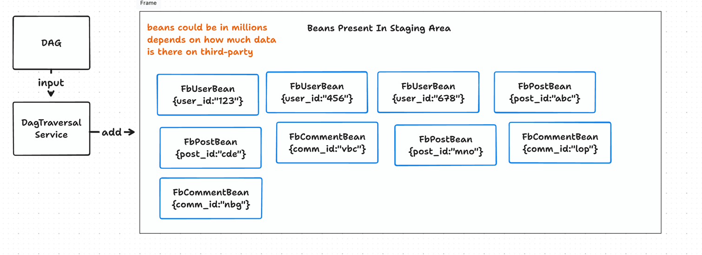

<!-- Beans START -->

`Beans` are intermediate data holder classes in Hagrid that it has fetched from `third-party` systems. It looks like this 




Once `steps` are declared, dev has to create `bean` classes for each of the `step`. Bean classes looks like this 

```java
@Getter
@Setter
@NoArgsConstructor
@JsonIgnoreProperties(ignoreUnknown = true)
public class FbUser extends AbstractBean {

    String user_id;
    String user_name;
}

```
Above bean class extends the `AbstractBean` and defines the attributes which needs to be kept in the system and discard others. 
For instance - If your `step` named `FbUser` which extends `AbstractStep` fetches data like this 



if the data fetches by `step` `fbUser` from `facebook` like above then `Hagrid` will keep just `user_name` and `user_id` in the system and discard 
rest of the attributes. 

It is the responsibility of the dev to add the attributes with right naming convention so that `deserlisation` works. Hagrid internally uses `Jackson` for deserialization
so you can use all its features in `beans`

**One more important thing to note**, `FbUser` step has to override multiple methods inherited from `AbstractStep` class. One of the method which links 
`steps` with `beans` is `parseSyncResponse` method. 

<!-- Beans END -->
