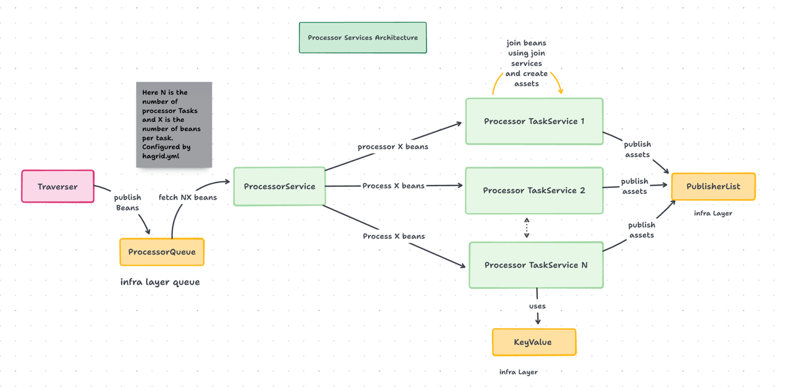

<!-- Processor START -->

Processor module contains services which helps you to perform ETL operations on the data (beans) fetched by `Traverser module`.
Processor module has many services to perform ETL process and are organised in this way


Take a look at below service diagram to better understand about processor module.





Here we can see three different kind of services

1. Processor Service
2. Processor Task Service
3. Package of Join Services
    1. Noop Join Service
    2. Inner Join Service
    3. Left Join Service


## Processor Service
Processor Service is the main service and its responsibility is to fetch beans from `processor_queue` ( infra layer) and launch number of processorTasks based on the
configuration provided by the developer in `Hagrid.yml`.

Once it fetches that number of beans, then it creates the instances of `ProcessorTasks` and pass part of the beans to each processor Tasks for processing.


## ProcessorTask Service
Processor Task service is the service whose responsibility is to create the assets based on the some logic which I am going to explain below.
Before that we need to understand an important object `assetBeanDependencyMap`




Each `processorTask` service has `assetBeanDependencyMap`. ProcessorTask service loops through each bean ( from the list provided by ProcessorService) and check
for each asset in `assetBeanDependencyMap`, if this asset can be build using this bean or not. Here are few possible cases

### Making Noop Assets
Noop Assets are the assets which depends on only one bean.   
There are the cases when an asset is simple asset i.e. just depends on single bean. For example - If an asset depends on just one bean like `beans.FbComment`
and current processing bean is also `beans.fbComment` then ProcessorTask will create the asset with this bean and publish into `publisher_list`

### Making of InnerJoin Assets
There are some assets which are created by the combination of two beans. Consider the below asset definition

```java
@Setter
@NoArgsConstructor
@JsonInclude(JsonInclude.Include.NON_EMPTY)
@JsonIgnoreProperties(ignoreUnknown = true)

@FreshJoin(rightClass = com.freshworks.hagrid.beans.User.class, uniqueJoinName = "user_usage_join",join_type = FreshJoin.JOIN_TYPE.INNER_JOIN,
        onFieldList = {
                @FreshJoin.OnField(rightClassFieldName ="id", leftClassFieldName = "user_id", leftClass =  com.freshworks.hagrid.beans.Usage.class),
        }
)

public class UserUsage extends AbstractAsset {
    
    String user_id;
    String usageValue;
    String userName;
    
    
    public void setUser_id(User user, Usage usage){
        this.user_id = user.getUserId();
        this.usageValue = usage.getUsage();
        this.userName = user.getUserName();
    
    }
}


    
```

As per the above asset `UserUsage` definition, this asset should be created with the following rules

1. Asset `UserUsage` depends on two beans `User` and `Usage`
2. Keys to join these two beans `User` and `Usage` are `user.id == usage.user_id`
3. Create Asset only when both beans are available i.e. INNER JOIN

So essentially, Hagrid (specifically `Processor Task Service`) will create this asset as soon as it found two beans in received which has
`user.id` and `usage.user_id` matched.

**Note**
Hagrid MUST receive both beans ( during the lifecycle of the sync) and matched on the key provided by the developer then only it
will create the asset.


### Making of Left Join Assets
There are some assets which are created by the combination of two beans. Consider the below asset definition

```java
@Setter
@NoArgsConstructor
@JsonInclude(JsonInclude.Include.NON_EMPTY)
@JsonIgnoreProperties(ignoreUnknown = true)

@FreshJoin(rightClass = com.freshworks.hagrid.beans.User.class, uniqueJoinName = "user_usage_join",join_type = FreshJoin.JOIN_TYPE.LEFT_JOIN,
        onFieldList = {
                @FreshJoin.OnField(rightClassFieldName ="id", leftClassFieldName = "user_id", leftClass =  com.freshworks.hagrid.beans.Usage.class),
        }
)

public class UserUsage extends AbstractAsset {
    
    String user_id;
    String usageValue;
    String userName;
    
    
    public void setUser_id(User user, Usage usage){
        this.user_id = user.getUserId();
        this.usageValue = usage.getUsage();
        this.userName = user.getUserName();
    
    }
}


    
```

As per the above asset `UserUsage` definition, this asset should be created with the following rules

1. Asset `UserUsage` depends on two beans `User` and `Usage`
2. Keys to join these two beans `User` and `Usage` are `user.id == usage.user_id`
3. Create asset as soon as `left` bean is available, does not matter if `right` has arrived or not yet.
4. Create asset as soon as both are available i.e. when `right` bean has also arrived.

So essentially, Hagrid (specifically `Processor Task Service`) will create this asset as soon as it found either just `left` bean OR when both beans has been received which has
`user.id` and `usage.user_id` matched.

**Note**
In case of `LEFT` join, Hagrid can create asset two times

1. When just LEFT bean has arrived with partial filled values of the asset.
2. When `RIGHT` beans has also arrived with completely filled values from both beans.

<!-- Processor END -->

<!-- ProcessorConfigService START -->
ProcessorConfigService is the service which holds the configuration for `processor services`. It reads processor configuration from
`hagrid.yaml` file.


<!-- ProcessorConfigService END -->


<!-- AssetBeanDependencyMap START -->

AssetBeanDependencyMap as the name suggest is the object which contains which `assets` depends on which all `beans`.
So when a developer creates assets like this

```java
@NoArgsConstructor
@Getter
@Setter
@JsonIgnoreProperties(ignoreUnknown = true)
@JsonInclude(JsonInclude.Include.NON_EMPTY)

public class FbComment extends AbstractAsset {

    String comment_id;
    String comment_title;
    String comment_text;

    public void setBatchFromBean(FbComment comment){

        comment_id = comment.getComment_id();
        comment_title = comment.getComment_title();
        comment_text = comment.getComment_text();
    }

    @Override
    public void transform() {
//        System.out.println("Creating comment asset");
    }

    @Override
    public Object getUniqueIdentifier() {
        return null;
    }
}
```
then Hagrid creates the dependency of asset named `com.freshworks.hagrid.assets.FbComment -> [com.freshworks.hagrid.beans.FbComment, com.freshworks.hagrid.beans.FbANyOtheralso]`
Hagrid build this map by reading method parameters of the methods present in asset class.
Hagrid build this static map for all assets present in asset path.

This `assetBeanDependencyMap` is very important for processor service to join beans on some key if a asset depends on multiple beans.

<!-- AssetBeanDependencyMap END -->
