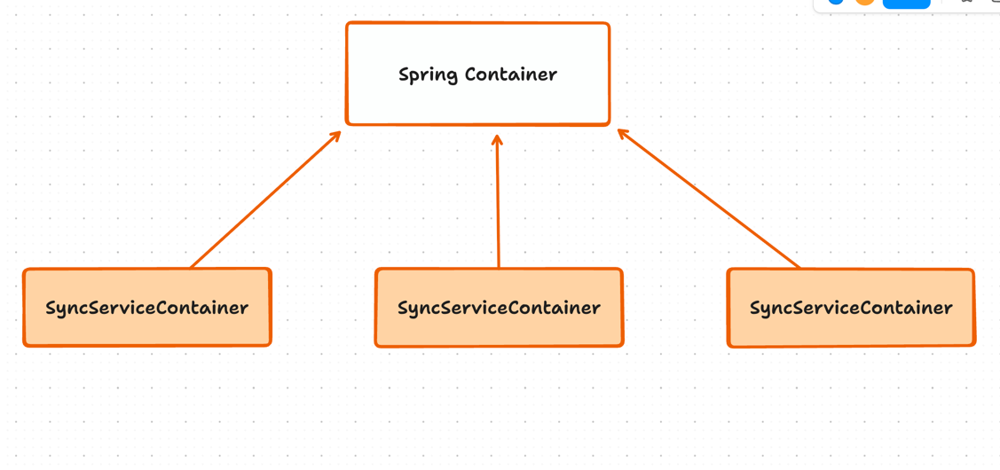

<!-- SyncServiceContainer START -->

When `Hagrid` runs the sync then it creates a container named `SyncServiceContainer` specifically for this particular sync.
`Hagrid` adds all services that it initialized for this sync into this container. It is very much like `Spring`
`ApplicationContext` container.

However, there is one difference, Spring container is init only once per `Java` application, `SyncServiceContainer` of hagrid is
different for each sync that it runs.

If you have access to `SyncServiceContainer`, you can access any internal service that `hagrid` has intialized to run this sync.

Below is the visualisation of the `SyncServiceContainer`




`SyncServiceContainer` exposes two methods via which you can fetch any service.

```java
public <T> T getBean(String bean);
public <T> T getBean(Class<T> bean); 
```

Suppose you want to fetch `TraverseConfigService` to configure `dynamic rate limit` then you can use `SyncServiceContainer`
like below

```java
TraverseConfigService traverseConfigService = syncServiceContainer.getBean(TraverseConfigService.class);
traverseConfigService.setStepRateLimit(FbUser.class, 200, 20);
```

If you fetch some service which is not `Hagrid Managed` then `getBean` method of the `SyncServiceContainer` service will
automatically fetch is from `Spring Application Container`

<!-- SyncServiceContainer END -->

