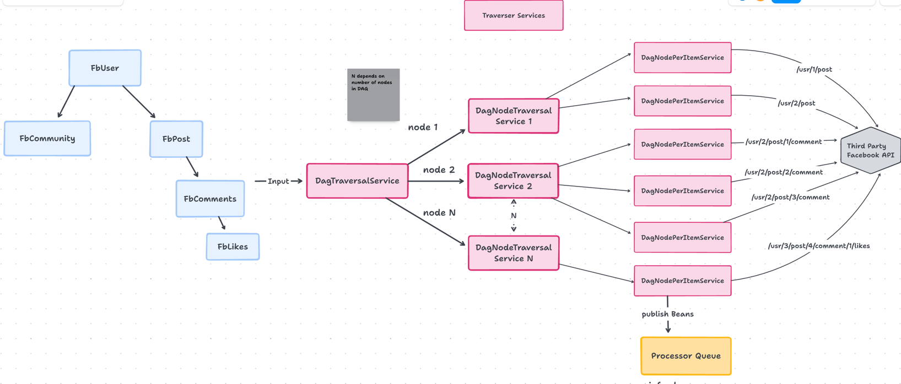

<!-- Traverser START -->

Traverser module contains the services which traverse the DAG and fetches data from internet efficiently. 
Services in this module takes care of various aspect of data loading like 

1. Dependency of APIs 
2. Rate limit on server end
3. Errors occurred during data transfer and transformation. 
4. Limitation of the machine like CPU and memory 

Take a look at services of Traverser module 





To traverser this DAG in efficient manner, we have three main services

1. DagTraversalService
2. DagNodeTraversalService
3. DagNodePerItemTraversalService


## DagTraversalService

`DagTraversalService` is the main service of `traverser` module. Every new sync has 1 instance of `DagTraversalService` and this instance is
responsible for traversing and managing the whole DAG.

It is the responsibility of this class to create instance of `DagNodeTraversal` class and run in separate thread. So for the above DAG,
`DagTraversalService` will launch 5 instances of `DagNodeTraversalService`, 4 for nodes present in DAG and 1 for top level node `Parent` that
Hagrid adds by default.

This class does not return until all nodes are traversed successfully ( with error or without error)


## DagNodeTraversalService
`DagNodeTraversalService` as name suggests, this service is responsible for traversing and managing a particular node of the DAG.

It is the responsibility of this class to `fetch Items of the parent node from infra layer` and for each item (parent data) fetched, launch the new `DagNodePerItemTraversalService`

For example - suppose we are discussing about the `DagNodeTraversalService` instance launched for dag node `fbPost` i.e. fetching data for fbPost, then it is the responsibility of this instance
to fetch list of all `fbUsers` (because it is a parent) from `infra layer` and then launch `DagNodePerItemTraversalService` for each of the `fbUser` so that it can fetch fbPosts for this `fbUser`.

This service `DagNodeTraversalService` also does not return until all `DagNodePerItemTraversalService` are returned.


## DagNodePerItemTraversalService

`DagNodePerItemTraversalService` as the name suggest is responsible for fetching data for this step say `fbPost` for a given parent ie.. `fbUser` say (user_id:2)
In this service, it creates the instance of `fbPost` step and inject `fbUser` item ( example user_id:2). This service calls various services of `fbPost` step
and run through until all data is fetched or some error occurred.

<!-- Traverser END -->


<!-- TraverseConfigService START -->

`TraverseConfigService` is the service which helps you to configure `traverser` module. Essential via this service, you
can configure various aspect of the `sync` like
1. Dynamic Rate limit

To setup rate limit for each step, you can use `TraverseConfigService` to set rate limit of each step dynamically.

Here is how it works

```java
TraverseConfigService traverseConfigService = syncServiceContainer.getBean(TraverseConfigService.class);
traverseConfigService.setStepRateLimit(FbUser.class, 200, 20);
```
<!-- TraverseConfigService END -->

