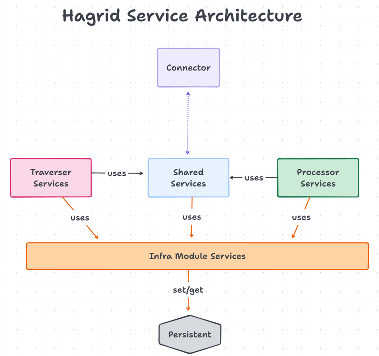

# Hagrid Service Architecture

Here, we are going to describe advance concepts of `Hagrid` which will be useful for you to develop scalable connector. 
Hagrid has 4 basic components

1. Traverser Module 
2. Processor Module 
3. Shared Module 
4. Infra Module

## Traverser Module 
Traverser module contains services which are responsible for fetching the data from third-party.
There are three major services for this module 

1. DagTraversalService - Work on the whole DAG. It spins `DagNodeTraversalService`
2. DagNodeTraversalService - Work on each node of the DAG. It spins each `DagNodePerParentTraversalService` instance for node with each of its parent.
3. DagNodePerParentTraversalService - As node can have multiple parents, each service instance works on `node<-->parent` relationship. Each parent can have millions of data. It spins limited number of `DagNodePerItemService` instance for each parent item. 
4. DagNodePerItemTraversalService - Works on each item of the parent and execute step of this node.  

## Processor Module 
Processor module contains services which are responsible for performing ETL process on the data fetched by traverser module.
There are four major services here 

1. ProcessorService 
2. ProcessorTaskService
3. Join Services
      1. InnerJoinService 
      2. LeftJoinService 
      3. NoopService

## Shared Module 
Shared module contains services which are used to synchronize both Traverser and Processor. For example `SyncStatusService`. 
Both `traverser` services and `processor` services report their status back to `SyncStatusService`.

There are three major services for this module 

1. SyncStatusService 
2. ConsumerService 
3. AnalyticsService 

## Infra Module 
Infra Module contains services which provides infra structure to the above three modules to work efficiently. For example 
All three `traverser services`, `processor services` and `shared services` use some kind of storage to store their data into persisten 
storage. 

