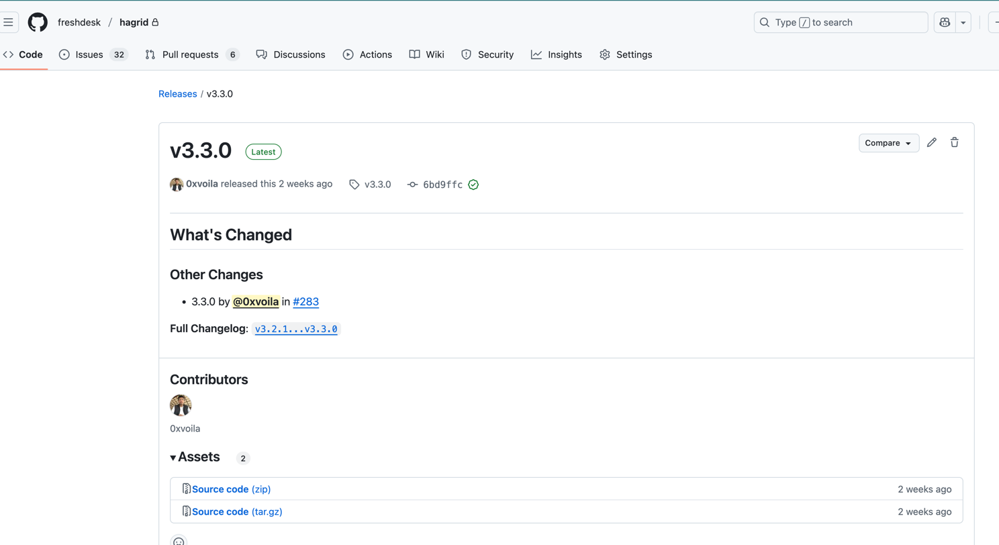
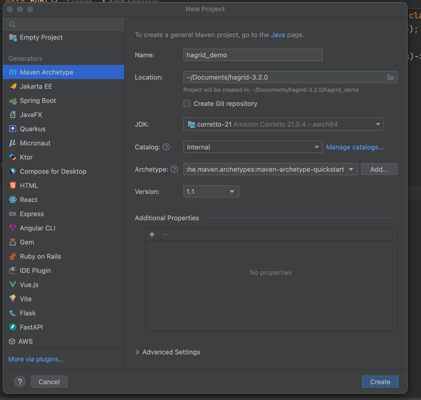
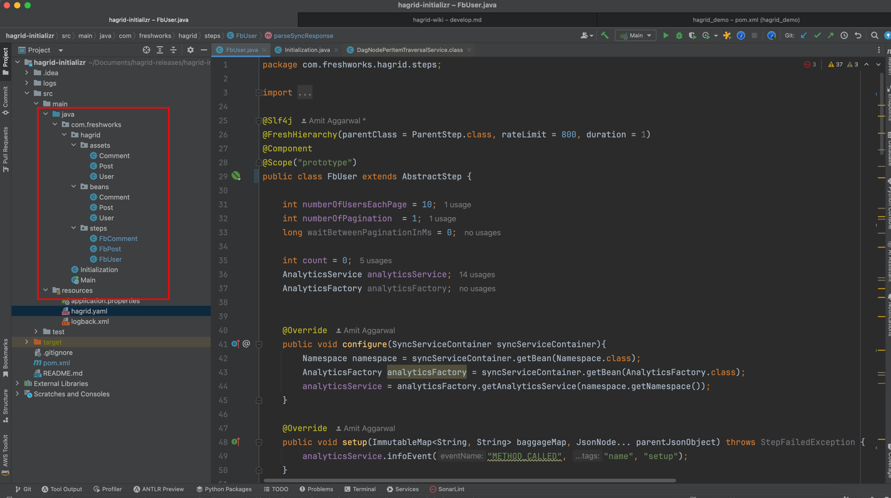
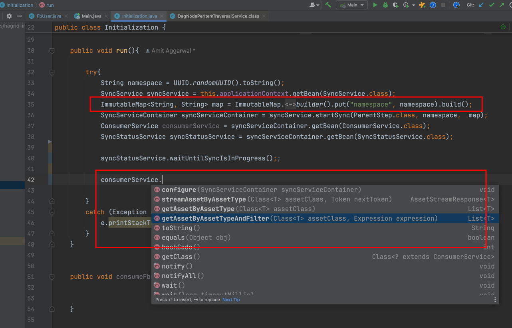

# Advance Connector Development

## Find Latest Version 

First, start with figuring out which is the latest version of `Hagrid` is released. To do this, visit
[Github Releases](https://github.com/freshdesk/hagrid/releases) and checkout the latest version.




`Hagrid` has some other dependencies as well to include therefore, we always releases the `hagrid-pom-some_version` which 
includes all dependencies for that version of `Hagrid`. 

So, if you are going to work with `Hagrid` version `3.4.0` then `dev` will actually include `hagrid-pom` with version `3.4.0`
in the `pom.xml`. It will ease the inclusion of `Hagrid` in a project. 


## Create Maven Project

Once, you have the last version number, then create the `maven` project with `quickstart` archtype, `java 21 or above`. 
`Hagrid` works with `Spring boot 3.3.*` or above. 





## Include Hagrid POM

Once, your maven project is ready then include this in the parent

```xml

  <parent>
    <groupId>com.freshworks</groupId>
    <artifactId>hagrid-pom</artifactId>
    <version>3.7.0</version>
  </parent>
```

Above dependency will bring `Hagrid 3.3.0`, right `spring boot` version and all other dependencies right away. `Devs` do
not have to add any other dependency unless they required it for their purpose


## Create Steps, Beans & Assets

Now, lets create three directories named `steps`, `beans` & `assets` like below




## Create Hagrid.yml file 
`Hagrid.yml` is the configuration file, that contains various configuration about `Hagrid`. 





## Consume Assets

Create a `main.java` from where you can run the `Spring boot` app like below 

```java


/**
 * Hello world!
 *
 */
@SpringBootApplication
public class Main
{
    public static void main( String[] args )
    {
        ApplicationContext applicationContext = SpringApplication.run(Main.class, args);
        Initialization initialization = applicationContext.getBean(Initialization.class);
        initialization.run();
    }
}

```

Here I have another class `Initilisation` which has method `run` which has code to run `Hagrid` like below 



**Here few things to note**

1. when calling `startSync` then pass `namespace`. It MUST be unique for every run of `hagrid sync`. 
2. To consume assets or checking sync status, `Hagrid` expose something known as `syncContainerService`, it is like 
   `Spring container` but it contains services initialized for the currently running sync. 
3. From `SyncContainerService`, you can fetch any services like `SyncStatusService` which tells about current sync status
4. From `SyncContainerService`, you can fetch `consumerService` which allow you to consume the assets. 


With the understanding of how to develop connectors on `Hagrid` , next move to [Advance](../usecases/steps.md) to understand various scenarios
that you may encounter with developing a connector and how to resolve them. 

Please reach out to me for any suggestions and questions at [Amit Aggarwal](mailto:amit.aggarwal@freshworks.com)


