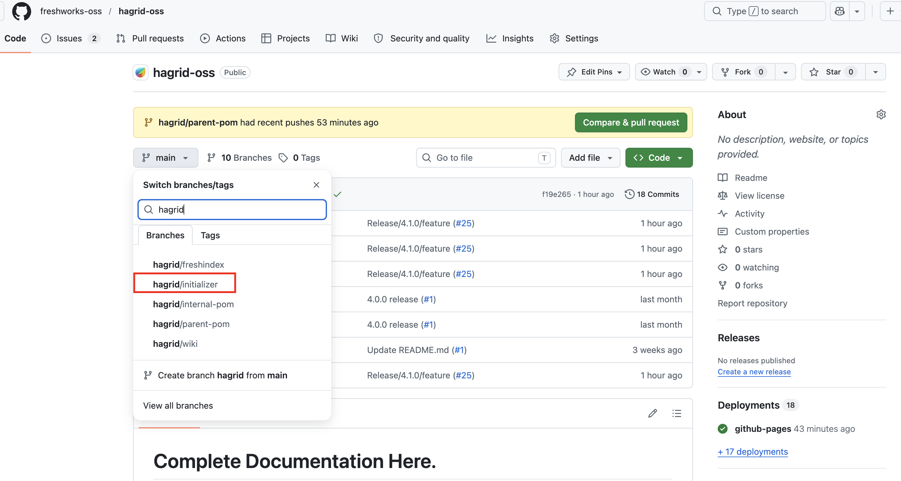
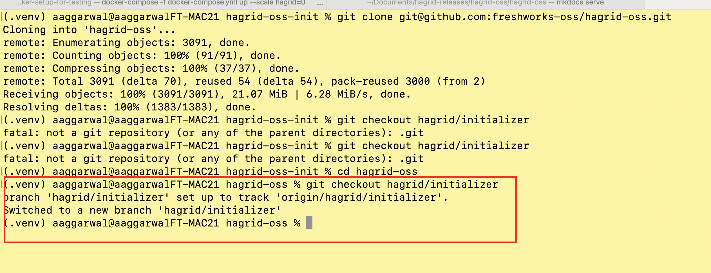
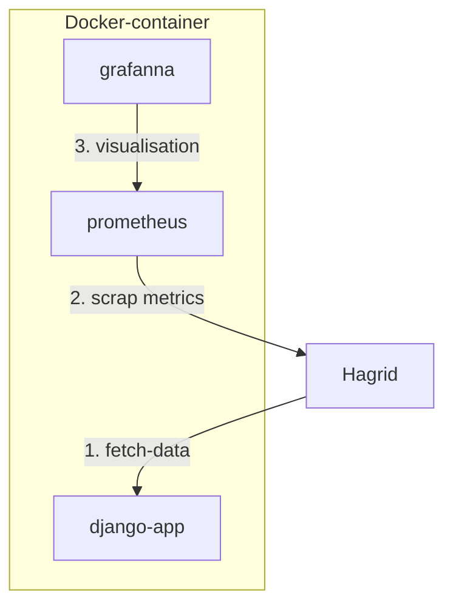
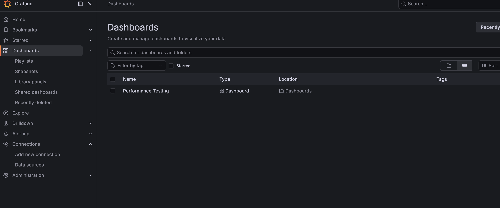
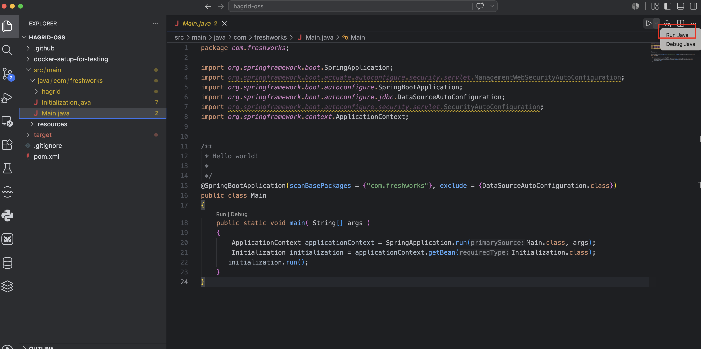
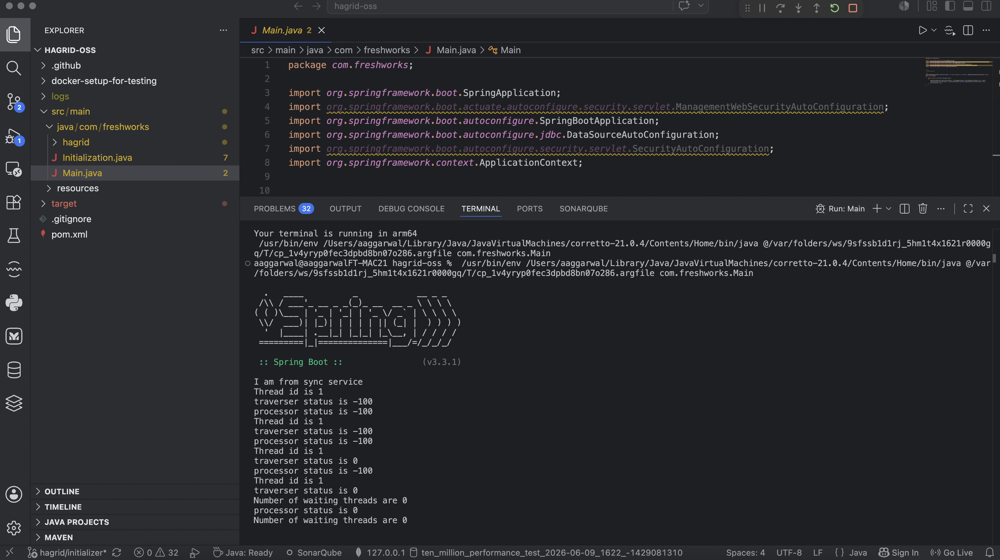
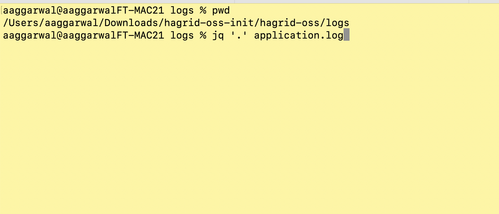
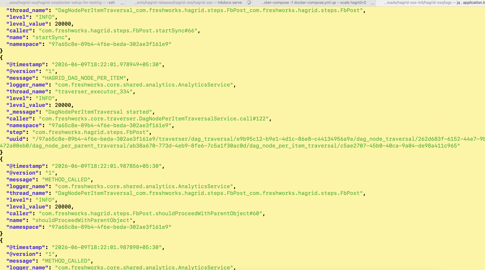
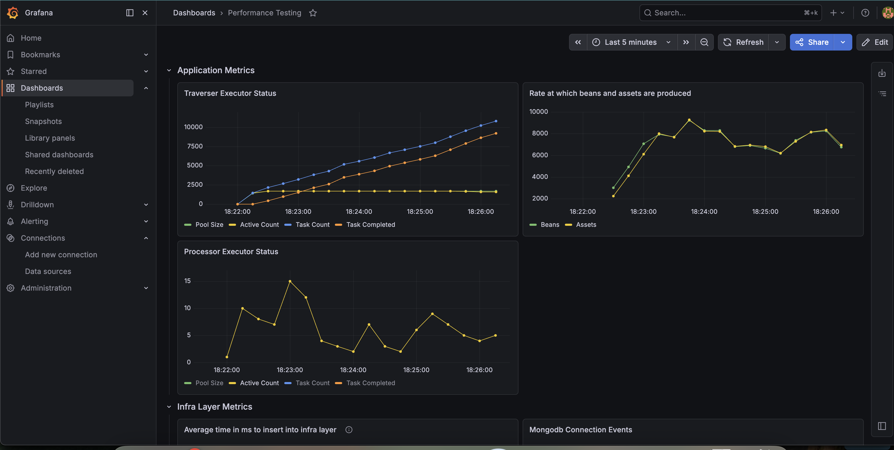

# Playground Setup 

In this section, we are going to do playground setup. Basically a setup which allow developers to understand and play around with various features of Hagrid with docker based setup. 

## Pre-requisite 
Below are the pre-requisite for setup up playground setup 

1. Docker - We need docker as we simulate various third-party calls via docker containers etc. 
2. IDE - Any IDE like `vscode` or `intellij` would be good enough.

## Get Started

With every released version of Hagrid, we release its `initializer` i.e fully functional code which would use that version of Hagrid. Main idea was to make it easy for developers to understand the new features added in this release. This idea is taken from `spring initializer` 

So now, go to Hagrid repository at [hagrid-repo](https://github.com/freshworks-oss/hagrid-oss), switch to branch `hagrid/initializer` branch

Checkout that branch on your local like below 

Next, look at the directory `docker-setup-for-testing`. This directory contains following containers 

1. `Django` - It acts as third-party server which has dummy APIs to simulate `facebook` api case
2. `Grafana` AND `Prometheus` - It is used to view metrics that Hagrid generated while fetching data from third-party.

So basically, we are going to run Hagrid on our local computer and it will connect with `django` , `grafana` , `prometheus` and `mongodb` inside docker. 

Architecture would be something like this 

After this you should be able to access following services 

Access `Grafana` on  `http://localhost:9091` 

1. Username would be `admin`
2. Password would be `amit` - You can change it from `docker-compose.yml` that comes along with Hagrid intializer

After login to granfa, you may not be seeing the dashboard `performance testing` out of the box. 

If so then please import the dashboard from this json [grafana Dashboard json](https://github.com/freshworks-oss/hagrid-oss/blob/main/src/main/resources/grafana_dashboard.json)

We have already set `prometheus` to scan metrics from `host.docker.internal:8080` in `docker-compose.yml` 

Once above metric setup is ready then next is to run Hagrid like below 

Hagrid in progress 

Hagrid logs 

Checkout grafana metrics 

**Note**
If you are still facing any kind of issue, please send your query at `user-hagrid@googlegroups.com` so that any one from community can answer. 

