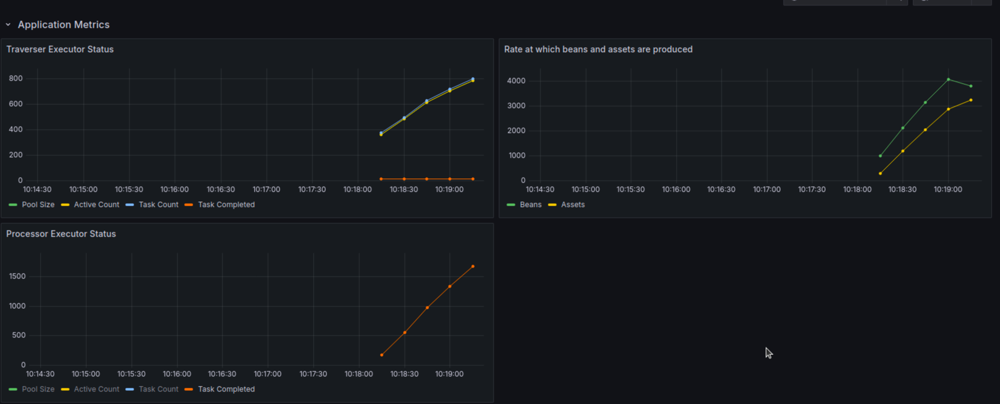
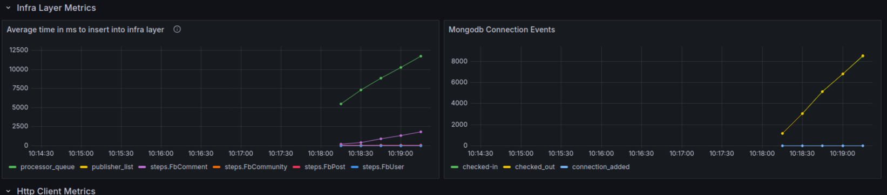
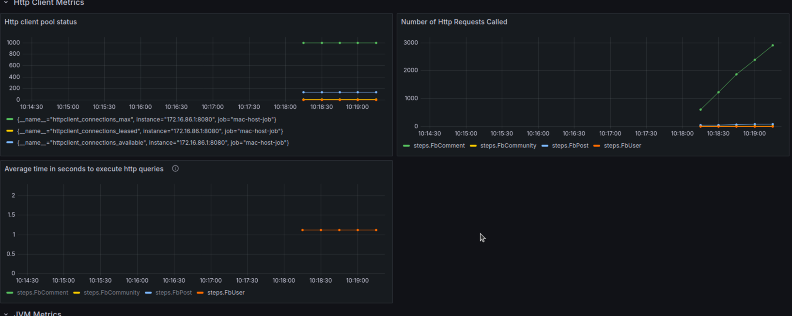
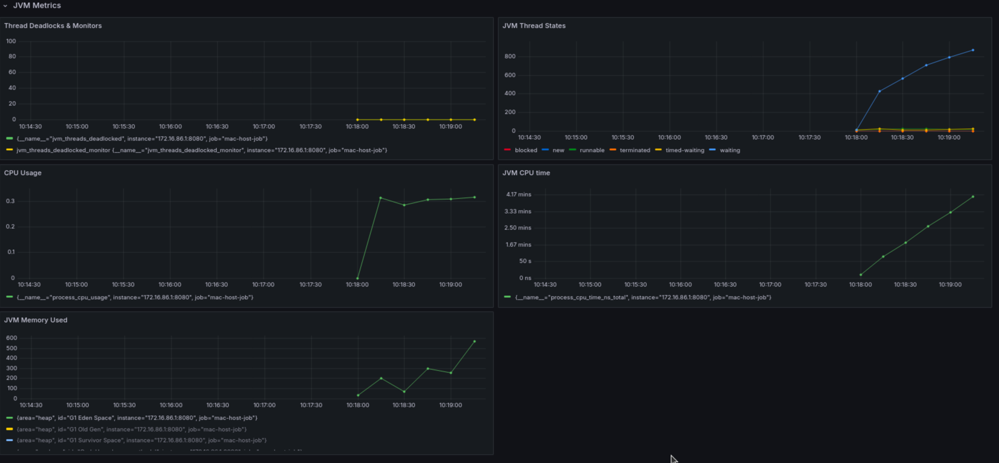

# Analytics Use cases

## Prometheus Metrics 
From version 3.6.0, we are publishing the grafana dashboard file in json format, which can be taken from resource folder.
Hagrid will emits the related metrics and can be visualise once grafana dashboard is imported.

Following metrics will be published

### Application Metrics
Application metrics refers to the metrics related to `Traverser` and `Processor`.
There are three metrics we are capturing
1. Traverser executor status - To understand traverser threads performance
2. Processor executor status - To understand processor threads performance
3. Performance of Traverser vs Processor - To understand overall how traverser and processor are performing  
   

### Infra Metrics
Infra metrics refers to how Hagrid's underline infra is performing
Here we are capturing two metrics
1. Average time it is taking to add an json string into infra - Determine performance of underline infra
2. Mongo connection event - If developer has chosen Mongodb as underline infra then how connection pool is working

### Http Client Metrics
To understand how http client is performing when fetching data from third-party
Here we capture three metrics
1. Http client pool
2. Number of http calls made
3. Average time taken to execute a http call

### JVM Metrics
To understand JVM level performance, we have added following metrics
1. Thread Deadlocks and Monitor
2. JVM CPU
3. JVM Memory
4. JVM Thread States

 
