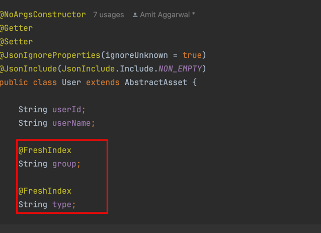

# Consuming assets from hagrid 
There are multiple ways to consume assets in Hagrid 

## Consume assets when sync is complete

If your use case is to consume assets when sync is complete then you can use `consumerService.getAssetByAssetType`. 
Use it like this 
```java
SyncServiceContainer syncServiceContainer = syncService.startSync(ParentStep.class, namespace,  map);
ConsumerService consumerService = syncServiceContainer.getBean(ConsumerService.class);
SyncStatusService syncStatusService = syncServiceContainer.getBean(SyncStatusService.class);
syncStatusService.waitUntilSyncIsInProgress();
analyticsService.meterGauge("HAGRID_STATUS", 1);
List<FbComment> commentList = consumerService.getAssetByAssetType(FbComment.class);
```

### Filter Assets when consuming via Consumer API 

Sometimes, you do not want to fetch all assets of a given asset type. You would like to filter assets say `User.class` based on
some conditions like `group` is `HR` or may be based on some complicated condition like `group` is `HR` AND `type` is '2'

If your usecase, falls into this scenario then follow below procedure

In `User.class` asset annotate fields like `group` and `type` with `@freshindex` annotation.

Below is the screenshot 




Once, you have annotated the asset fields with @FreshIndex then you can use the `Expression` object on how to create filter 
queries like below. 

Please make a note of this `$.com.freshworks.hagrid.assets.User.group` mentioned in the below snippet. Here it refers to the 
**complete package path of the asset** that you want to filter **MUST starts with `$.`** like we do in JsonPath. 

```java
ConsumerService consumerService = syncServiceContainer1.get().getBean(ConsumerService.class);

            // Use consumer service to consume Assets fetched by Hagrid

            // Consume assets of a given type
            List<User> userAssetList = consumerService.getAssetByAssetType(User.class);


            // Consume assets of a given type based on simple condition
            // Suppose while consuming user type assets, you want to fetch only assets
            // where group is HR, here `group` is one of the attribute in User Asset annotated with @freshIndex
            Expression expression = Expression.expressionBuilder()
                    .whenAssetFieldName("$.my.package.path.of.the.asset.User.group")
                            .is()
                                    .whenAssetFieldValue("HR")
                                            .build();

            List<User> userAssetListFilterByGroup = consumerService.getAssetByAssetTypeAndFilter(User.class, expression);


            // Consume assets of a given type based on simple condition
            // Suppose while consuming user type assets, you want to fetch only assets
            // where group is HR and `user_type` is `2`, here `group` and `type` are attributes in User Asset annotated with @freshIndex
            Expression expression1 = Expression.expressionBuilder()
                    .whenAssetFieldName("$.my.package.path.of.the.asset.User.group")
                    .is()
                    .whenAssetFieldValue("HR")
                    .build();

            Expression expression2 = Expression.expressionBuilder()
                            .whenAssetFieldName("$.my.package.path.of.the.asset.User.type")
                            .is()
                            .whenAssetFieldValue("2")
                            .build();

            Expression finalExpression = Expression.expressionJoiner()
                    .whenRightExpressionIs(expression1)
                            .whenJoinerIsAnd()
                                    .whenLeftExpressionIs(expression2)
                                            .build();


            List<User> userAssetListFilterByGroupAndType = consumerService.getAssetByAssetTypeAndFilter(User.class, finalExpression);
            
```


**Pro Tip**
Using `Expression Joiner`, you can join multiple expression with multiple conditions like 

(((A OR B) AND C) OR D ) , FreshIndex would be able to resolve it and return you the right set of assets matching the condition. 

Example of some complicated Filter condition is below 

```java
Expression expression1 = Expression.expressionBuilder()
                    .whenAssetFieldName("$.my.package.path.of.the.asset.User.group")
                    .is()
                    .whenAssetFieldValue("HR")
                    .build();

            Expression expression2 = Expression.expressionBuilder()
                            .whenAssetFieldName("$.my.package.path.of.the.asset.User.type")
                            .is()
                            .whenAssetFieldValue("2")
                            .build();

            Expression intermediateExpression = Expression.expressionJoiner()
                    .whenRightExpressionIs(expression1)
                            .whenJoinerIsAnd()
                                    .whenLeftExpressionIs(expression2)
                                            .build();
            
            
            /// This will create this expression ( group is HR AND type is 2 )

            Expression expression3 = Expression.expressionBuilder()
                .whenAssetFieldName("$.my.package.path.of.the.asset.User.origin")
                    .is()
                    .whenAssetFieldValue("India")
                .build();


            Expression finalExperssion = Expression.expressionJoiner()
                    .whenRightExpressionIs(intermediateExpression)
                    .whenJoinerIsOR()
                    .whenLeftExpressionIs(expression3)
                    .build();
        
            // Final expression is ((group is HR AND type is 2 ) OR (origin is India))

        List<User> userAssetListFilterByGroupAndTypeOROriginIndia = consumerService.getAssetByAssetTypeAndFilter(User.class, finalExpression);
```


### Scenario to use this API 
Use this API when 
1. the assets produced from the syncs are small.
2. If data set is huge then try to use freshIndex to retrieve only small set at a time. 
3. Sync usually completes in short time because you wait until whole syn is complete.


### Some Tips 
If you had many assets then bringing them into memory could leak to bump in memory usage.  


## Consume assets as soon as they are generated. 
If your use case is to consume assets as soon as they are generated then you can do it via `consumerService.streamAssetByAssetType` API

To consume assets via `consumerService.streamAssetByAssetType`, run it in a while loop which checks if hagrid is still running then 
keep calling this method to get any new generated asset. Here is the pseudo code 

```java
    AssetStreamResponse.Token token = new AssetStreamResponse.Token();
            token.setStart(0);
            token.setStart(100);
AssetStreamResponse assetStreamResponse = null;
            while(syncStatusService.getSyncStatus() == 0 ){
assetStreamResponse = consumerService.streamAssetByAssetType(FbUser.class, token);

// Here is your list of 100 assets
List<FbUser> fbUserList = assetStreamResponse.getAbstractAssetList();

// new token return by consumerService itself.
// If there are no new assets yet then this token contains start = 101 and count - 100
// you pass this token back to consumerService to fetch data
// if there is not data then list of assets will be empty
// always use streamAssetByAssetType in loop so that you can get it terminated when sync is complete.
// consumerService itself does not know anything about syncStatus, hence we need to use while loop to keep
// fetching data until sync is complete.
token = assetStreamResponse.getNextToken();
            }

// Make a final fetch in case there are some more assets
// This is to avoid a race condition like below 
// Assume 
// 1. processorService generates some assets
// 2. Sync status changes to successful 
// 3. above while loop will check if sync is progress, which is not then it will go out of loop 
// how ever, there are some more assets got generated in between. Hence we have to use this final fetch. 
assetStreamResponse = consumerService.streamAssetByAssetType(FbUser.class, token);
List<FbUser> fbUserList = assetStreamResponse.getAbstractAssetList();
```

### Scenario to use this API
Use this API when you want 

1. You want to consume assets from hagrid as soon as they are generated so that you can process them on some other service.

2. You know, third party APIs respond quickly, there is not much rate limit issues

      1. Because, if `traverserService` can not fetch data from third party quickly then generation of the assets would be slow 
      2. If generation of the assets is slow then as your consumer service is in loop which will consume many CPU cycles for nothing. 


### Some tips

1. As stated above, this API can consume many CPU cycles if third-party APIs are slow from where hagrid's `traverserService` fetches data. So to avoid this use `Thread.sleep(100ms)`
2. Another way to get assets as soon as they are generated is by using `AnalyticsService`, which is much more efficient 


