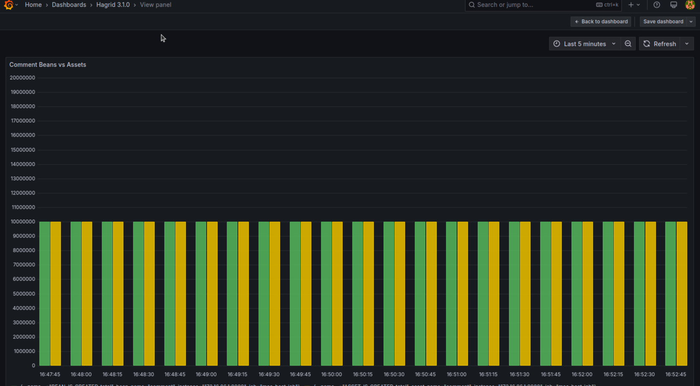
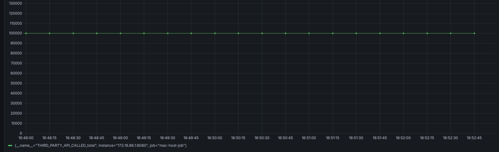
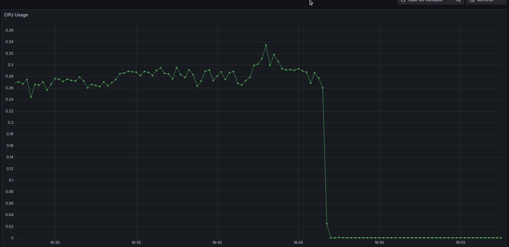
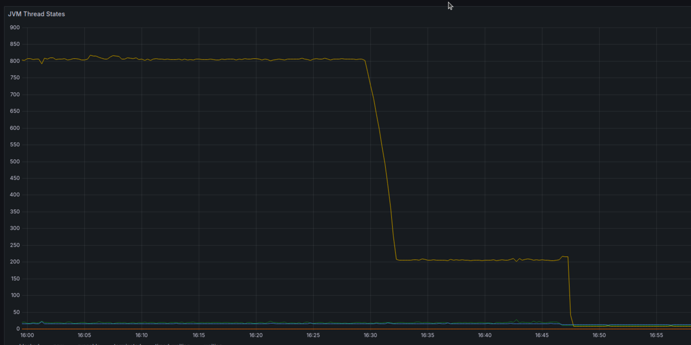

# Version [3.1.0] - [6th April 2024]

## Added
Below are the features has been added to this version

### Introduction of Analytics Service
For more information about analytics service, please refer to [Analytics Feature](../features/analytics.md#analytics-service)

### Injection of syncServiceContainers 
From version 3.1.0, `steps`, `beans` and `assets` would have one extra method `configure` inherited from parent 

```java

    public void configure(SyncServiceContainer syncServiceContainer){
        AnalyticsFactory analyticsFactory = syncServiceContainer.getBean(AnalyticsFactory.class);
        Namespace namespace = syncServiceContainer.getBean(Namespace.class);
        analyticsService = analyticsFactory.getAnalyticsService(namespace.getNamespace());

    }
    
```

This method, enables the injection of `syncServiceContainer` is all `steps`, `beans` and `assets`. 
Using `syncServiceContainer`, developer can obtain any service which is specific to this sync. You can think of `syncServiceContainer` 
like `spring container` but just for this specific run. 

Using `syncServiceContainer`, devs can get `AnalyticsFactory` class and `Namespace` class which contains the namespace of the current sync ( that dev )
that can be used to get the instance of `analyticsService`

## Performance Testing Results

### Number of assets payloads generated  

Minimal lag to no lag between `traverserService` and `processorService` when processing 10M payloads

Green color shows `beans` generated and yellow color shows `assets` generated 




### Number Third party APIs called

Hagrid has called more than 100K APIs  




### CPU usage 

On an average 30% of the CPU is used, which translated to 3 CPU core as my mac has 9 CPUs. 




### JVM Thread

Most of the threads are either in `waiting state` or `runnable state`. 




-----