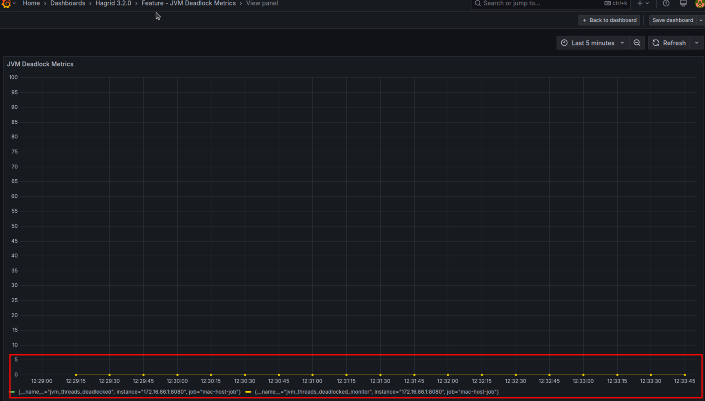

# Version [3.2.0] - [16th April 2024]

## Added
Below are the features has been added to this version

### Addition of JVM metrics 
Under this feature, we are exposing JVM metrics like deadlocks and monitor to prometheus so that devs know the state of the application. 
Devs can use any visualisation tools like grafana for viewing the metrics. 

