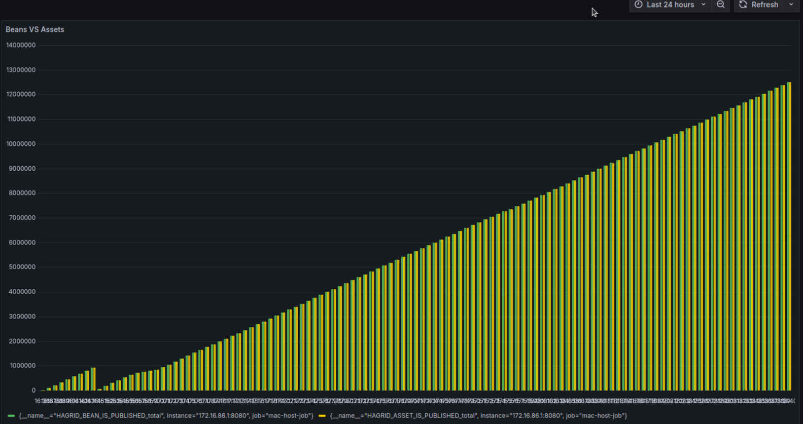
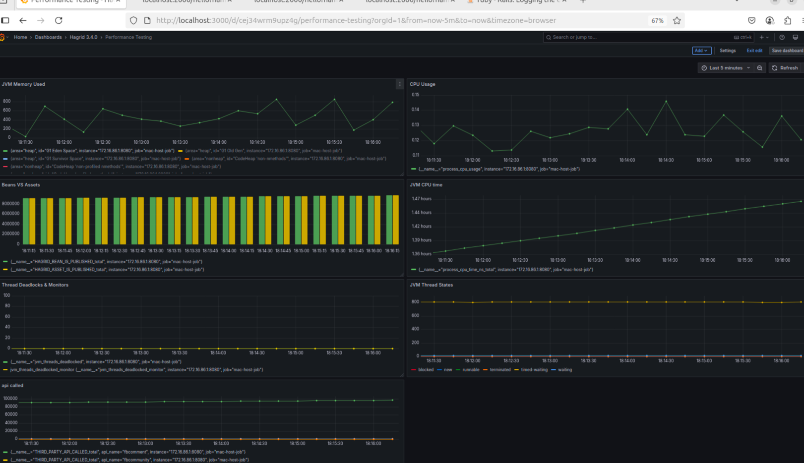
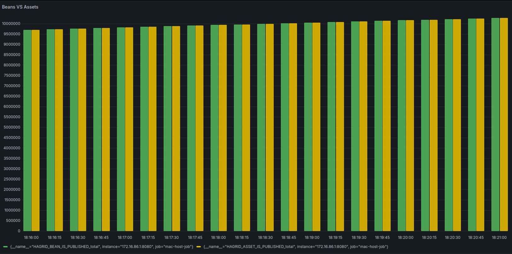
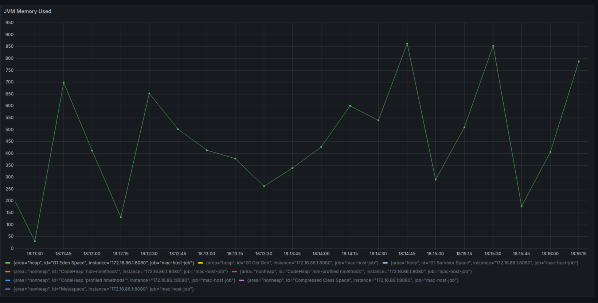
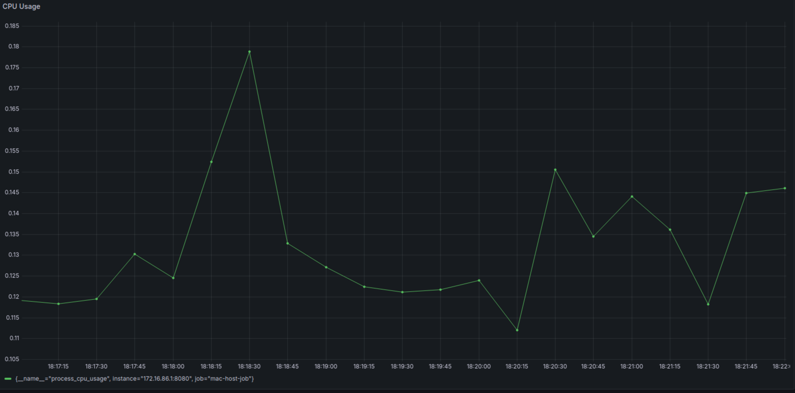
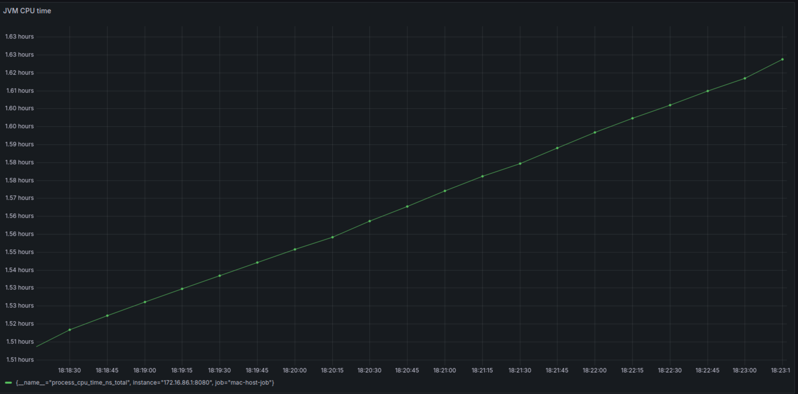
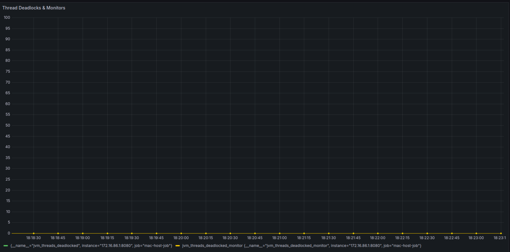
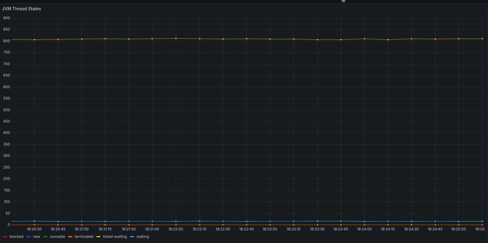
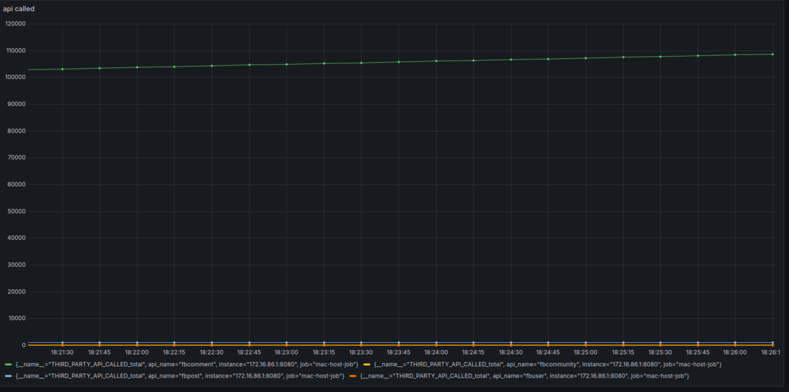

# Version [3.4.0] - [COMPLETED]

## Added
### Dynamic Rate Limit 
Today, Hagrid provides a way for managing rate limit constraints set by third party providers for their APIs. Devs can manage via @FeshHierarchy annotation on the top of each step. For instance,

```java
@Slf4j
@FreshHierarchy(parentClass = ParentStep.class, rateLimit = 800, duration = 20)
@Component
@Scope("prototype")
public class FbUser extends AbstractStep {
}
```

In the above step, with the help of @FreshHierarchy annotation, dev has mentioned to limit API calls to 800 APIs per 20 seconds. So when Hagrid will start processing FbUser, it will try to limit the API calls to the third party server within the mentioned limit.

However, there are cases where devs cannot mention this limit beforehand or statically. For example, when a third party allows their customers to set custom limits on APIs for their accounts (e.g., OKTA). In such cases, specifying a static rate limit will not work. Here, devs would like to customize the rate limit for each step dynamically.

#### Usage
Following is the way in which dynamic rate limit can be configured by dev:

public void some_app_method(){

	SyncServiceContainer syncServiceContainer = syncService.initSyncServiceContainer("namespace here");
	TraversConfigService traverConfigService = syncServiceContainer.getBean(TraverseConfig.class);

	traverseConfigService.setRateLimit(FbUserStep.class, 200, 20);

	syncService.startSync(syncServiceContainer, FBUser.class, baggageMap)

}
Here, to configure any part of the Hagrid before starting the sync, SyncServiceContainer can be retrieved via the newly introduced method named initSyncServiceContainer.

Once syncServiceContainer is available, configuration services like TraverseConfigService, ProcessorConfigService, InfraConfigService can be configured.

Once syncServiceContainer is configured, then start the sync with this syncServiceContainer.

Please find the Detailed Specification Request for this feature at [github link](https://github.com/freshdesk/hagrid/issues/291)

### Addition of Prometheus Metrics
Hagrid now generate prometheus events to count number of beans generated and number of assets produced. 
For information look at [Beans And Asset Metrics Events](/usecases/analytics/#total-number-of-beans-generated-by-traverser)

For internal performance testing, we use it to compare how many assets are generated against beans




### Addition of JVM Metrics 
Hagrid emits JVM metrics via spring `actuator`. Metrics will be exposed on endpoint `<host>:<port>/actuator/prometheus`
For more information look at [JVM Metrics](/usecases/analytics/#jvm-metrics)


## Performance Test Results
I performed test cases wherein third-party returns 10Million payloads. Here are the results 

### Overall Metrics 
Overall Performance remain the same and no impact due to this change in the performance of Hagrid 


### Beans Produced VS Assets Created
Below metrics shows that `traverser` and `processor` are working parallely and rate of production of beans by `traverser` 
is same as that of `rate of consumption beans to produce assets` by `processor`



###  JVM Memory Metrics 
Memory taken up is less than `1000MB` during the whole process.  


### CPU Metrics 
CPU taken is around 30% of the available CPU in my mac. I have 9 cores so that would translate to 3 CPU core required. 



### JVM Time Taken 
It took approximately 2 hours to sync the 10Millions assets. 



### Thread Deadlocks & Monitors
There are no deadlocks issued by JVM. 



### JVM Thread States 
Below thread metrics shows that we have very less threads in `blocked` state. Either they are in `waiting` or `running`.



### Total APIs Called
Total APIs called are around 100K to the third party. 



